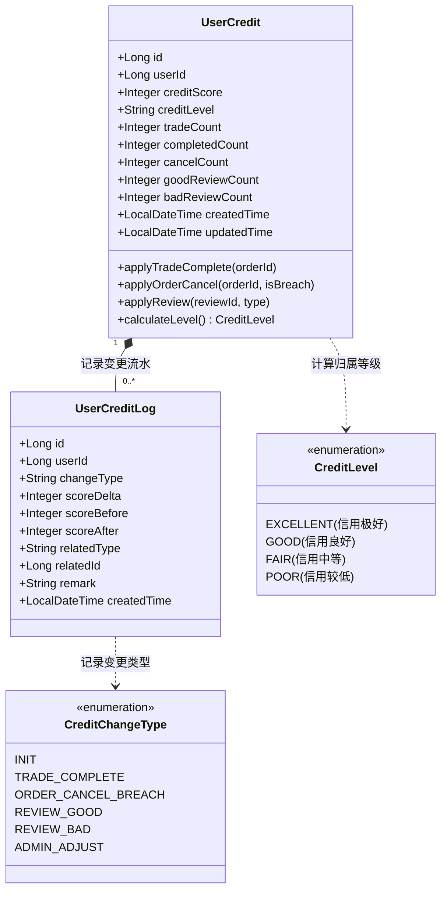
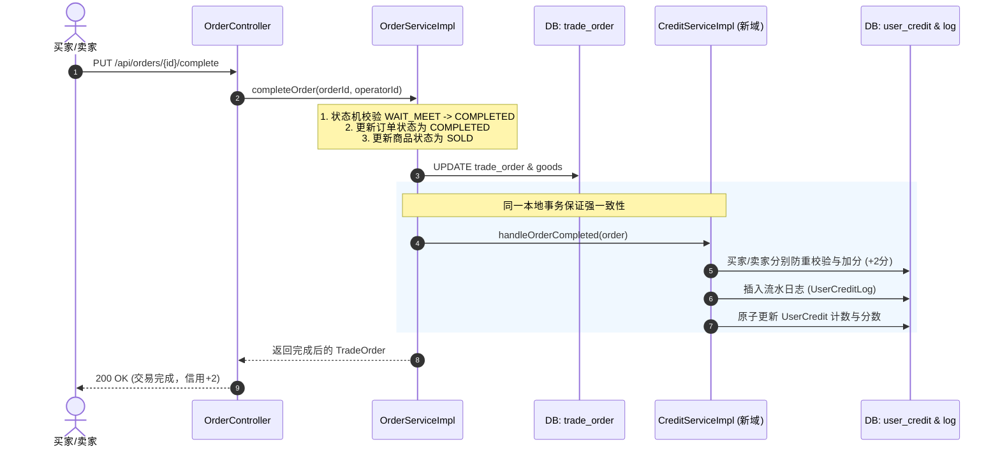
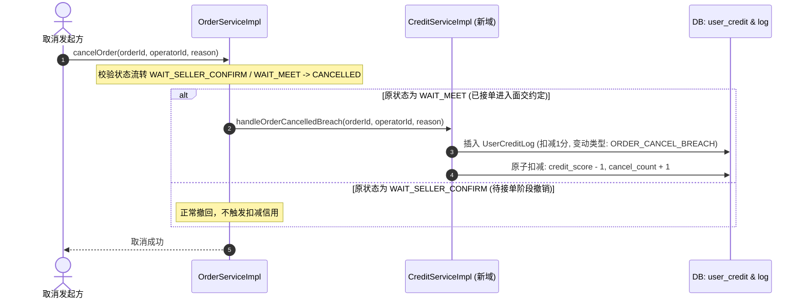

# CampusTrade 校园二手交易平台 Stage 5-A 信用体系架构与设计方案

> **版本**：v1.0.0  
> **阶段**：Stage 5-A（信用体系设计与审计）  
> **状态**：设计完成 / 等待确认  
> **设计原则**：简单透明、可解释、可审计、可调整、防刷防作弊、不过度设计  
> **限制说明**：本阶段只进行审计与架构设计，不修改任何工程代码，不执行数据库迁移，不实现 Controller/Service/Mapper/Flutter 页面。

---

## 目录
- [一、现有信用体系深度审计](#一现有信用体系深度审计)
  - [1.1 现状排查与代码审计](#11-现状排查与代码审计)
  - [1.2 核心问题专项回答](#12-核心问题专项回答)
- [二、信用模型设计 (Domain Model)](#二信用模型设计-domain-model)
  - [2.1 聚合根：UserCredit（用户信用档案）](#21-聚合根usercredit用户信用档案)
  - [2.2 实体：UserCreditLog（信用变更流水）](#22-实体usercreditlog信用变更流水)
  - [2.3 状态与等级枚举设计](#23-状态与等级枚举设计)
- [三、信用计算与流转规则设计](#三信用计算与流转规则设计)
  - [3.1 基础分值与积分边界](#31-基础分值与积分边界)
  - [3.2 记分规则与奖惩矩阵](#32-记分规则与奖惩矩阵)
  - [3.3 信用等级划分与业务权益](#33-信用等级划分与业务权益)
  - [3.4 可解释性与透明度说明](#34-可解释性与透明度说明)
- [四、数据库设计 (Flyway V5 SQL 草案)](#四数据库设计-flyway-v5-sql-草案)
  - [4.1 表结构变更说明](#41-表结构变更说明)
  - [4.2 Flyway V5 Migration 脚本草案（仅供评审，未执行）](#42-flyway-v5-migration-脚本草案仅供评审未执行)
- [五、业务流程与事务一致性设计](#五业务流程与事务一致性设计)
  - [5.1 订单履约完成触发信用更新](#51-订单履约完成触发信用更新)
  - [5.2 订单违约取消触发信用扣减](#52-订单违约取消触发信用扣减)
  - [5.3 未来评价接入触发信用更新](#53-未来评价接入触发信用更新)
  - [5.4 并发安全性与幂等保障 (Lost Update 防范)](#54-并发安全性与幂等保障-lost-update-防范)
- [六、安全防刷与审计干预机制](#六安全防刷与审计干预机制)
  - [6.1 权限控制与接口封闭](#61-权限控制与接口封闭)
  - [6.2 防刷单防对敲限额机制](#62-防刷单防对敲限额机制)
  - [6.3 管理员人工调控与可追溯审计](#63-管理员人工调控与可追溯审计)
- [七、未来演进路线 (Roadmap)](#七未来演进路线-roadmap)

---

## 一、现有信用体系深度审计

### 1.1 现状排查与代码审计

对项目现有代码（Stage 1 ~ Stage 4-D）进行了全面的只读审计，涉及数据库、持久层、业务层、表现层及前端：

| 模块/层级 | 现有实现文件 | 现有核心逻辑与字段 | 审计结论 |
| :--- | :--- | :--- | :--- |
| **Flyway V1 迁移** | `V1__init_user_and_auth_schema.sql` | 创建 `campus_trade.user_credit` 表：`id`, `user_id`, `credit_score` (默认 100), `trade_count` (默认 0), `good_review_count` (默认 0), `bad_review_count` (默认 0), `created_time` | 表结构具备基础雏形，但缺少 `updated_time`、细分履约统计及等级字段，缺乏流水表 |
| **实体层 (Entity)** | `UserCredit.java` | 包含 `id`, `userId`, `creditScore`, `tradeCount`, `goodReviewCount`, `badReviewCount`, `createdTime` | 仅为简单 POJO，缺少业务领域行为；缺少版本号/更新时间 |
| **Mapper 层** | `UserCreditMapper.java` | 继承 MyBatis-Plus `BaseMapper<UserCredit>` | 基础 CRUD，缺少原子增减（如 `incrementCreditScore`）的自定义 SQL |
| **用户注册流程** | `AuthServiceImpl.java` | 用户注册成功时，初始化一条 `UserCredit` 记录（score=100, tradeCount=0） | 正确初始化了用户初始档案 |
| **用户资料获取** | `UserServiceImpl.java` | 查询用户信用组装进 `UserCreditVO` 返回 | 前端可获取基本信用指标 |
| **商品详情页** | `GoodsServiceImpl.java` | 关联查询发布者（卖家）的信用积分并注入 `GoodsVO.sellerCreditScore` | 实现了买家浏览商品时的信用背书展示 |
| **订单履约完成** | `OrderServiceImpl.java:274` | `completeOrder` 成功后调用私有方法 `incrementTradeCount(order.getBuyerId())` 与 `sellerId` | 存在痛点：1. 仅对 `tradeCount` 做 +1；2. 采用查出对象再 `updateById`，高并发下存在**丢失更新 (Lost Update)** 风险；3. 逻辑耦合在订单服务内，缺乏独立领域边界 |
| **前端展现** | `user_model.dart`, `goods_detail_page.dart`, `profile_page.dart` | 展示 `creditScore`、`tradeCount` 等 | 前端具备基础信用分展示，用户对“信用分”已有明确心智认知 |

---

### 1.2 核心问题专项回答

#### 问题 1：目前有哪些信用数据？
- **数据存储**：存储在 PostgreSQL `campus_trade.user_credit` 表中。
- **现有字段**：
  1. `id` (BIGINT PK)
  2. `user_id` (BIGINT UNIQUE)
  3. `credit_score` (INT, 默认 100)
  4. `trade_count` (INT, 默认 0)
  5. `good_review_count` (INT, 默认 0)
  6. `bad_review_count` (INT, 默认 0)
  7. `created_time` (TIMESTAMP)
- **业务触发数据**：订单 `WAIT_MEET -> COMPLETED` 时，买卖双方 `trade_count` 各自 +1。

#### 问题 2：哪些数据可以直接复用？
- **`user_id`**：与用户实体强关联的主外键关系完全一致。
- **`credit_score`**：作为信用积分数值体系的核心指标，沿用 100 分作为基准起步分。
- **`trade_count`**：累计参与交易数，可直接平滑沿用历史数据。
- **`good_review_count` / `bad_review_count`**：评价统计字段，可向下兼容沿用。
- **前端模型与展示协议**：`UserCreditVO` 和前端 `UserCreditModel` 可以向下完全兼容，在扩展新字段的同时不破坏既有前端界面。

#### 问题 3：哪些字段与能力缺失？
1. **履约细分指标缺失**：
   - 缺少 `completed_count`（实际顺利完成履约笔数）。当前 `trade_count` 在订单完成时递增，但无法表达“已下单未履约”与“实际完成”的履约率。
   - 缺少 `cancel_count`（取消/违约订单数）。无法评估用户是否有恶意放鸽子、频繁毁约的行为。
2. **综合分级指标缺失**：
   - 缺少 `credit_level`（信用等级枚举，如 EXCELLENT / GOOD / FAIR / POOR）。目前仅有裸数字，缺乏直观的信用标签与用户分层。
3. **审计与时效字段缺失**：
   - 缺少 `updated_time`：无法得知信用档案最近一次更新时间。
4. **可审计流水缺失（致命缺失）**：
   - **完全没有流水日志表**。信用分由 100 分变成了 104 分，无法追溯是由于哪两笔订单完成、还是哪个好评、什么时间变更的，属于不可追溯黑盒，无法满足风控与对账需求。
5. **并发安全与幂等机制缺失**：
   - 当前在 Java 中 `setTradeCount(count + 1)` 并 update，缺乏数据库原子递增或乐观锁；且若订单处理由于重试被调用两次，可能导致重复计数。

#### 问题 4：是否需要新增信用领域？
- **结论：必须新增独立的信用领域（Credit Domain）**。
- **原因**：
  1. **职责分离**：订单服务（`OrderService`）的核心职责是订单生命周期与状态流转，不应感知复杂的信用计算规则、分值封顶、防刷策略。
  2. **多源驱动**：未来的信用变更不仅来源于订单完成（+2分），还来源于违约取消（-1分）、商品评价（+3分 / -5分）、人工客服调账（Admin）。如果散落在各个服务中，规则将难以维护且极易失真。
  3. **可解释性与对账要求**：信用体系必须具备“可追溯、可审计”的流水生命周期，需要独立的 `CreditService` 和 `UserCreditLog` 领域支撑。

---

## 二、信用模型设计 (Domain Model)

在 DDD（领域驱动设计）指导下，信用系统划归为独立的子域。



### 2.1 聚合根：UserCredit（用户信用档案）

| 字段名 | 类型 | 约束 | 默认值 | 描述 |
| :--- | :--- | :--- | :--- | :--- |
| `id` | BIGINT | PRIMARY KEY | - | 档案唯一ID（雪花算法/序列） |
| `user_id` | BIGINT | UNIQUE NOT NULL | - | 关联用户ID |
| `credit_score` | INT | NOT NULL, CHECK(0~200) | 100 | 综合信用积分（基准100分，上限200分，下限0分） |
| `credit_level` | VARCHAR(20) | NOT NULL | 'GOOD' | 信用评级：EXCELLENT / GOOD / FAIR / POOR |
| `trade_count` | INT | NOT NULL, >= 0 | 0 | 累计参与交易总次数（作为买家或卖家） |
| `completed_count` | INT | NOT NULL, >= 0 | 0 | 累计顺利履约完成笔数 |
| `cancel_count` | INT | NOT NULL, >= 0 | 0 | 累计主动取消或违约取消笔数 |
| `good_review_count`| INT | NOT NULL, >= 0 | 0 | 获得好评数（Stage 5-D评价接入） |
| `bad_review_count` | INT | NOT NULL, >= 0 | 0 | 获得差评数（Stage 5-D评价接入） |
| `created_time` | TIMESTAMP | NOT NULL | CURRENT_TIMESTAMP | 档案创建时间 |
| `updated_time` | TIMESTAMP | NOT NULL | CURRENT_TIMESTAMP | 最后一次变动时间 |

---

### 2.2 实体：UserCreditLog（信用变更流水）

记录每一笔信用积分变动的详细脉络，实现“一分一据、终身可溯”。

| 字段名 | 类型 | 约束 | 描述 |
| :--- | :--- | :--- | :--- |
| `id` | BIGINT | PRIMARY KEY | 流水唯一ID |
| `user_id` | BIGINT | NOT NULL, INDEX | 变动归属用户ID |
| `change_type` | VARCHAR(32) | NOT NULL | 变动类型（枚举） |
| `score_delta` | INT | NOT NULL | 变动分值（例如 +2, -1, +3, -5） |
| `score_before` | INT | NOT NULL | 变动前积分 |
| `score_after` | INT | NOT NULL | 变动后积分 |
| `related_type` | VARCHAR(32) | NOT NULL | 关联业务实体类型：`ORDER`, `REVIEW`, `SYSTEM`, `ADMIN` |
| `related_id` | BIGINT | NOT NULL | 关联业务实体ID（如 order_id, review_id） |
| `remark` | VARCHAR(255) | NOT NULL | 用户可读明细（如“订单 ORD20260917001 线下顺利面交履约完成”） |
| `created_time` | TIMESTAMP | NOT NULL | 流水生成时间 |

> **幂等约束保障**：  
> 建立唯一复合索引 `uk_credit_log_user_event (user_id, related_type, related_id, change_type)`，确保同一次订单完成或同一个评价在极端并发或重试下，绝对不会重复入账加分或扣分。

---

### 2.3 状态与等级枚举设计

#### 信用评级（CreditLevel）
- `EXCELLENT`：信用极好（130 ~ 200 分）
- `GOOD`：信用良好（100 ~ 129 分，基准默认）
- `FAIR`：信用中等（80 ~ 99 分）
- `POOR`：信用较低（0 ~ 79 分）

#### 变动事件类型（CreditChangeType）
- `INIT`：初始档案建立（+100）
- `TRADE_COMPLETE`：线下订单顺利履约完成（+2）
- `ORDER_CANCEL_BREACH`：接单后单方面违约取消（-1）
- `REVIEW_GOOD`：交易后获得买家/卖家好评（+3）
- `REVIEW_BAD`：交易后获得买家/卖家差评（-5）
- `ADMIN_ADJUST`：客服核实争议或治理违规人工调控（自定义 $\pm N$）

---

## 三、信用计算与流转规则设计

本着**简单透明、可解释、可审计、不引入复杂黑盒模型**的原则，规则全部采用直观、清晰的整数积分运算。

### 3.1 基础分值与积分边界
- **初始基准分**：新注册并完成初始化的学生用户，初始信用分为 **100 分**。
- **积分区间**：`[0, 200]` 分。
  - **最大上限 200 分**：防止老用户或刷单者无限累积分值导致分值通胀；
  - **最低下限 0 分**：分值不设负数，降至 0 分后触发严重限制。

---

### 3.2 记分规则与奖惩矩阵

| 触发场景 | 影响角色 | 状态条件 | 变动分值 | 统计影响 | 说明与解释 |
| :--- | :--- | :--- | :--- | :--- | :--- |
| **订单顺利完成** | 买家 & 卖家 | `WAIT_MEET -> COMPLETED` | **+2 分** | `trade_count + 1`<br>`completed_count + 1` | 双方依约完成线下面交，鼓励真实履约 |
| **待确认阶段取消** | 买家或卖家 | `WAIT_SELLER_CONFIRM -> CANCELLED` | **0 分** | `trade_count + 0`<br>`cancel_count + 0` | 卖家未接单前双方协商撤回或改期，不构成实质履约违背，不扣分 |
| **已接单后违约取消** | 取消发起方 (`cancelled_by`) | `WAIT_MEET -> CANCELLED` | **-1 分** | `cancel_count + 1` | 双方已约定面交后单方面取消，给对方造成等待时间损失，按违约轻度惩戒 |
| **已接单后违约取消** | 被动被取消方 | `WAIT_MEET -> CANCELLED` | **0 分** | 无变化 | 无责任方不承担惩罚 |
| **获得好评** | 被评方 | Stage 5-D 评价发布（五星/满意） | **+3 分** | `good_review_count + 1` | 交易体验优秀，正向激励 |
| **获得差评** | 被评方 | Stage 5-D 评价发布（一星/差评） | **-5 分** | `bad_review_count + 1` | 存在货不对板、爽约迟到等严重不良体验，负向惩戒 |
| **平台纠纷人工干预** | 违规方/受害方 | 管理员后台申诉审核 | **$\pm N$** | 根据申诉判定 | 解决校园恶意报复差评或逃避履约问题 |

---

### 3.3 信用等级划分与业务权益

根据综合信用分（`credit_score`），平台自动为用户评定信用等级，并在 UI 侧呈现不同视觉徽章：

```
[0 ---------- 79] ------------ [80 -------- 99] ------------ [100 ------- 129] ------------ [130 -------- 200]
     POOR (信用较低)                FAIR (信用中等)               GOOD (信用良好)               EXCELLENT (信用极好)
   限制发布与下单频次              提示珍惜履约信用              基准正常校园权益               “诚信二手”专属金牌徽章
```

| 信用等级 | 分值区间 | 界面徽章标签 | 平台业务权限与防风控策略 |
| :--- | :--- | :--- | :--- |
| **EXCELLENT (极好)** | 130 ~ 200 | 🏅 **极好·诚信卖家/买家** | 享受首页推荐加权、商品优先展示、买卖免押/免排队。 |
| **GOOD (良好)** | 100 ~ 129 | 🟢 **良好·履约稳定** | 平台标准用户，享受所有正常商品发布与交易功能。 |
| **FAIR (中等)** | 80 ~ 99 | 🟡 **中等·偶有违约** | 页面给出友好提醒；限制同时处于进行中的待面交订单上限为 3 笔。 |
| **POOR (较低)** | 0 ~ 79 | 🔴 **较低·信誉受限** | 限制单日仅能发布 1 件商品；禁止同时并发多笔订单；详情页提示买家“对方信用较低，请谨慎面交”。 |

---

### 3.4 可解释性与透明度说明
平台对信用分的任何变动均遵循**透明白盒原则**：
1. 用户在“个人信用主页”可以看到明确的动态计算明细：  
   $\text{信用分} = 100\text{(初始)} + (\text{完成数} \times 2) + (\text{好评数} \times 3) - (\text{违约取消} \times 1) - (\text{差评数} \times 5) + \text{调账分}$
2. 每一笔变动流水均能清晰展示：**时间、事件来源（订单号）、变动分值、原因解释**，完全拒绝黑盒算法评分，杜绝学生的心理抵触。

---

## 四、数据库设计 (Flyway V5 SQL 草案)

> [!IMPORTANT]  
> **工程规范声明**：  
> 以下 SQL 仅为设计阶段评审草案，严格按照用户指令，**不在本次 Stage 5-A 中写入 `db/migration/` 目录，也不对数据库执行变更**。将在后续 Stage 5-B 批准后正式落地。

### 4.1 表结构变更说明
1. **更新现有 `campus_trade.user_credit` 表**：
   - 增加 `credit_level` (VARCHAR(20), 默认 'GOOD')
   - 增加 `completed_count` (INT, 默认 0)
   - 增加 `cancel_count` (INT, 默认 0)
   - 增加 `updated_time` (TIMESTAMP, 默认 CURRENT_TIMESTAMP)
   - 增加 `credit_score` 范围检查约束 `CHECK (credit_score >= 0 AND credit_score <= 200)`
2. **新增 `campus_trade.user_credit_log` 流水表**：
   - 记录用户信用分每一次变动的完整快照。
   - 建立 `user_id` 索引及事件唯一约束以防重。

---

### 4.2 Flyway V5 Migration 脚本草案（仅供评审，未执行）

```sql
-- ==============================================================================
-- Flyway Migration V5: Stage 5 信用体系升级与审计流水表设计 (DRAFT ONLY)
-- ==============================================================================

-- 1. 升级用户信用档案表
ALTER TABLE campus_trade.user_credit
    ADD COLUMN IF NOT EXISTS credit_level VARCHAR(20) NOT NULL DEFAULT 'GOOD',
    ADD COLUMN IF NOT EXISTS completed_count INT NOT NULL DEFAULT 0,
    ADD COLUMN IF NOT EXISTS cancel_count INT NOT NULL DEFAULT 0,
    ADD COLUMN IF NOT EXISTS updated_time TIMESTAMP NOT NULL DEFAULT CURRENT_TIMESTAMP;

-- 2. 为 user_credit 表增加信用积分上下限检查约束 (0 ~ 200)
DO $$
BEGIN
    IF NOT EXISTS (
        SELECT 1 FROM pg_constraint WHERE conname = 'chk_user_credit_score_range'
    ) THEN
        ALTER TABLE campus_trade.user_credit
            ADD CONSTRAINT chk_user_credit_score_range CHECK (credit_score >= 0 AND credit_score <= 200);
    END IF;
END $$;

-- 3. 补全历史已完成订单的 completed_count（平滑兼容历史数据）
UPDATE campus_trade.user_credit
SET completed_count = trade_count
WHERE completed_count = 0 AND trade_count > 0;

-- 4. 创建信用变更流水日志表
CREATE TABLE IF NOT EXISTS campus_trade.user_credit_log (
    id BIGINT PRIMARY KEY,
    user_id BIGINT NOT NULL,
    change_type VARCHAR(32) NOT NULL,
    score_delta INT NOT NULL,
    score_before INT NOT NULL,
    score_after INT NOT NULL,
    related_type VARCHAR(32) NOT NULL,
    related_id BIGINT NOT NULL,
    remark VARCHAR(255) NOT NULL,
    created_time TIMESTAMP NOT NULL DEFAULT CURRENT_TIMESTAMP
);

-- 5. 索引建设
CREATE INDEX IF NOT EXISTS idx_credit_log_user_time 
    ON campus_trade.user_credit_log(user_id, created_time DESC);

CREATE INDEX IF NOT EXISTS idx_credit_log_related 
    ON campus_trade.user_credit_log(related_type, related_id);

-- 6. 唯一防重约束：同一业务事件对同一用户同类变动只能入账一次（强幂等性）
CREATE UNIQUE INDEX IF NOT EXISTS uk_credit_log_idempotent 
    ON campus_trade.user_credit_log(user_id, related_type, related_id, change_type);

-- 7. 字段注释
COMMENT ON TABLE campus_trade.user_credit IS '用户信用档案表';
COMMENT ON COLUMN campus_trade.user_credit.credit_score IS '当前综合信用分，区间0-200，初始100';
COMMENT ON COLUMN campus_trade.user_credit.credit_level IS '信用等级：EXCELLENT, GOOD, FAIR, POOR';
COMMENT ON COLUMN campus_trade.user_credit.completed_count IS '实际顺利履约完成笔数';
COMMENT ON COLUMN campus_trade.user_credit.cancel_count IS '主动取消或违约取消笔数';

COMMENT ON TABLE campus_trade.user_credit_log IS '用户信用积分与行为审计流水日志表';
COMMENT ON COLUMN campus_trade.user_credit_log.change_type IS '变动类型：TRADE_COMPLETE, ORDER_CANCEL_BREACH, REVIEW_GOOD, REVIEW_BAD, ADMIN_ADJUST';
COMMENT ON COLUMN campus_trade.user_credit_log.score_delta IS '分值变动（正负整数）';
COMMENT ON COLUMN campus_trade.user_credit_log.related_type IS '关联业务类型：ORDER, REVIEW, ADMIN';
COMMENT ON COLUMN campus_trade.user_credit_log.related_id IS '关联业务主键ID';
```

---

## 五、业务流程与事务一致性设计

### 5.1 订单履约完成触发信用更新



---

### 5.2 订单违约取消触发信用扣减



---

### 5.3 未来评价接入触发信用更新
在后续 Stage 5-D 评价系统上线后，信用域将提供对齐的领域服务契约：
```java
// 信用服务评价结算契约（接口草案）
public interface CreditService {
    void handleOrderCompleted(TradeOrder order);
    void handleOrderCancelled(TradeOrder order, Long operatorId);
    void handleReviewSubmitted(Long reviewId, Long targetUserId, Integer rating, String comment);
}
```
评价提交时，根据评价星级（如 5 星 $\to$ 好评 +3 分，1 星 $\to$ 差评 -5 分），直接调用 `CreditService` 进行记分与流水留存。

---

### 5.4 并发安全性与幂等保障 (Lost Update 防范)

现有实现中存在的问题：
```java
// ❌ 现有 OrderServiceImpl.java:467-470 (存在并发覆盖风险)
int currentCount = credit.getTradeCount() != null ? credit.getTradeCount() : 0;
credit.setTradeCount(currentCount + 1);
userCreditMapper.updateById(credit);
```
**安全改造策略（将在 Stage 5-B/C 实施）**：
1. **原子递增更新**：  
   放弃“先查后改”逻辑，改为在 Mapper 中执行原子 SQL：
   ```sql
   UPDATE campus_trade.user_credit
   SET credit_score = LEAST(200, GREATEST(0, credit_score + #{delta})),
       trade_count = trade_count + #{tradeInc},
       completed_count = completed_count + #{completeInc},
       cancel_count = cancel_count + #{cancelInc},
       credit_level = #{newLevel},
       updated_time = CURRENT_TIMESTAMP
   WHERE user_id = #{userId};
   ```
2. **流水表唯一键防重（强幂等）**：  
   `user_credit_log` 的唯一索引 `(user_id, related_type, related_id, change_type)` 从数据库底层切断网络重发或并发点击导致的重复加分。

---

## 六、安全防刷与审计干预机制

为保障校园交易生态公平、健康，杜绝通过小号刷单、虚假对敲刷高信用分，设计以下安全策略：

### 6.1 权限控制与接口封闭
- **无公网写接口**：Controller 层**严禁开放任何允许客户端传入积分或直接修改信用统计的 API**。
- **只读查询**：
  - 用户仅可通过 `GET /api/users/profile` 查看自身信用；
  - 允许通过 `GET /api/credit/logs`（后续规划）分页查看自身信用流水明细；
  - 商品详情页仅能通过后端脱敏 VO 读取卖家的公开信用分与等级标签。

---

### 6.2 防刷单防对敲限额机制

在 `CreditServiceImpl` 规则引擎中内置**三大轻量级防刷规则**：
1. **自买自卖拦截**：在订单创建阶段已实现 `buyerId != sellerId` 强校验；
2. **同交易双方频控封顶**：
   - 规则：**同一买家与同一卖家在 24 小时内完成的多笔订单，仅第一笔发放 +2 信用分**（后续笔数正常完成交易并更新 `trade_count`，但不再增加 `credit_score`，并在流水记录中标记 `FREQ_LIMIT_SKIP` 说明）；
3. **单日最高增长上限**：
   - 规则：单用户每日（00:00 ~ 23:59）因“订单履约完成”与“获得好评”获得的信用加分总额**上限为 10 分**。达到上限后不再累加分数，防止短时间内批量对敲刷分。

---

### 6.3 管理员人工调控与可追溯审计
针对校园线下可能出现的“恶意差评、纠纷调解、违规诈骗账号”场景：
1. 预留系统调控操作类型：`ADMIN_ADJUST`；
2. 只有具备 `ROLE_ADMIN` 权限的客服/管理员可通过专用后台接口发起信用调控；
3. 调控必须强制录入 `operator_id` 与 `reason`（违规处理决定书编号或调解备注文档）；
4. 调控记录同样全额记录入 `user_credit_log`，供系统全量审计。

---

## 七、未来演进路线 (Roadmap)

| 阶段代号 | 阶段目标 | 重点任务 | 准入/依赖条件 |
| :--- | :--- | :--- | :--- |
| **Stage 5-A (当前)** | **信用体系架构设计与审计** | 现状审计、领域模型、计算规则、SQL草案、防刷设计 | 依赖 Stage 4 订单闭环完成 |
| **Stage 5-B** | **数据库迁移与核心实体落地** | 执行 Flyway V5 数据库迁移，实现 `UserCredit` 扩展及 `UserCreditLog` 实体/Mapper | 待 Stage 5-A 方案确认 |
| **Stage 5-C** | **信用领域服务与规则引擎实现** | 实现 `CreditService` 与并发安全原子更新，解耦并接入 `OrderServiceImpl` | 依赖 Stage 5-B |
| **Stage 5-D** | **交易后评价系统开发** | 评价表设计、REST API、好评/差评与信用联动更新闭环 | 依赖 Stage 5-C |
| **Stage 5-E** | **前端信用中心与信誉展示** | Flutter 个人信誉中心、流水明细、商品详情信誉徽章展示 | 依赖 Stage 5-C/D |

---

## 八、审计与设计总结

1. **审计结论清晰**：现有系统已具备 `campus_trade.user_credit` 表与基础分，订单完成时已具备原始累加动作；但缺乏细分履约统计、评级分类、变动流水与并发防刷保护。
2. **模型扩展平滑**：新设计的 `UserCredit` 扩展字段与 `UserCreditLog` 流水表对现有 Stage 1~4-D 代码与前端完全**向下兼容**，不破坏任何既有业务。
3. **规则简单透明**：采用校园适用的百分制基准（100基准，0~200分段），加分扣分规则明确可解释，提供高透明度用户体验与坚固的防刷风控。
4. **执行边界严守**：本阶段**未编写任何 Java/Flutter 生产代码，未修改数据库**，全部成果已落盘至规范设计文档。
