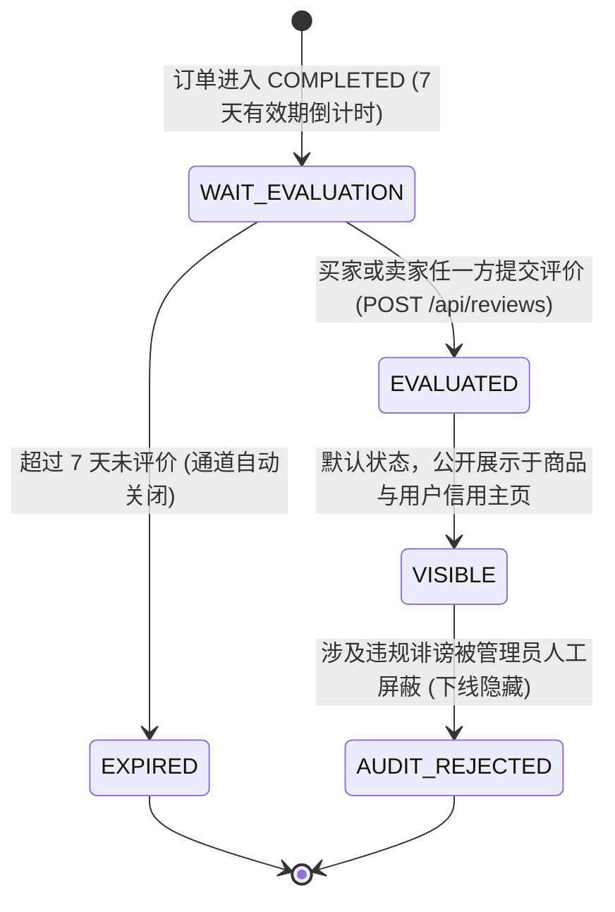

# Stage 5-C: 评价系统设计与信用联动评审报告 (Design Review Report)

> **阶段**：Stage 5-C（评价系统设计与信用联动）  
> **状态**：设计完成 / 评审就绪 (Design Review Only)  
> **工程约束执行说明**：本阶段未编写任何 Java/Flutter 生产代码，未新增任何数据库迁移文件，未修改 Stage 0~5-B 既有逻辑。  

---

## 一、完成内容总结

在 Stage 5-C 中，架构团队针对校园二手交易平台的**评价系统 (Review System)** 及其与 **信用体系 (Credit Domain)** 的联动集成完成了深度的技术审计与全链路方案设计，产出了 7 份专业规格文档：

1. [`Stage5-C-review-existing-analysis.md`](file:///d:/wkk/Second-hand%20trading%20platform/docs/stage5/Stage5-C-review-existing-analysis.md)：订单与信用体系深度审计及架构解耦决策；
2. [`Stage5-C-review-domain-design.md`](file:///d:/wkk/Second-hand%20trading%20platform/docs/stage5/Stage5-C-review-domain-design.md)：Review 聚合根模型、字段不可变性及业务规则规范；
3. [`Stage5-C-review-database-design.md`](file:///d:/wkk/Second-hand%20trading%20platform/docs/stage5/Stage5-C-review-database-design.md)：`campus_trade.review` 数据库架构及物理防重唯一索引设计（Flyway V6 规划草案）；
4. [`Stage5-C-review-credit-linkage.md`](file:///d:/wkk/Second-hand%20trading%20platform/docs/stage5/Stage5-C-review-credit-linkage.md)：5 阶星级加权积分矩阵、事件驱动驱动架构与反刷对敲风控；
5. [`Stage5-C-review-api-contract.md`](file:///d:/wkk/Second-hand%20trading%20platform/docs/stage5/Stage5-C-review-api-contract.md)：完整 RESTful 接口、DTO/VO 结构与标准错误码体系；
6. [`Stage5-C-review-security-design.md`](file:///d:/wkk/Second-hand%20trading%20platform/docs/stage5/Stage5-C-review-security-design.md)：IDOR 防护、防差评勒索、敏感词过滤安全防线；
7. [`Stage5-C-design-review-report.md`](file:///d:/wkk/Second-hand%20trading%20platform/docs/stage5/Stage5-C-design-review-report.md)：本终审总结报告。

---

## 二、关键架构决策 (Architectural Decisions)

1. **解耦订单主档，零侵入原有表**：  
   `trade_order` 表保持原汁原味，不新增 `buyer_reviewed` 等碎片字段；双向评价状态通过 `review` 表根据 `(order_id, reviewer_id)` 动态投影，保持 Stage 4 订单代码的纯洁性与高稳定性。
2. **Spring 本地领域事件驱动架构 (Domain Events)**：  
   `ReviewService` 持久化评价后，通过 `ApplicationEventPublisher` 发布 `ReviewCreatedEvent`；由 `CreditReviewEventListener` 监听并调用 Stage 5-B 的 `CreditService`，实现评价与信用的物理级松耦合。
3. **前端伪匿名 + 后端强实名**：  
   支持前台勾选“匿名评价”消除校园熟人心理负担，但后端与流水强实名绑定 `reviewer_id`，信用加减与防刷风控照常精准生效。
4. **评价永久不可修改、不可用户自主删除**：  
   从根源切断“差评勒索红包”、“私下改好评”等黑灰产行为；遇到恶意纠纷由管理员通过平台人工争议调账通道处理。

---

## 三、评价状态生命周期与流转图

- **双方评价异步性处理**：  
  买卖双方评价彼此独立互不依赖。买家评价后即刻生成一条 `Review` 并计入卖家信用，无需强行等待卖家回评；卖家亦可随时单独评价买家。

---

## 四、信用联动矩阵与防刷策略

### 4.1 评分与信用变动映射
- ⭐⭐⭐⭐⭐ (5星)：`+3` 分，`good_review_count + 1`，类型 `REVIEW_GOOD`
- ⭐⭐⭐⭐ (4星)：`+1` 分，`good_review_count + 1`，类型 `REVIEW_GOOD`
- ⭐⭐⭐ (3星)：`0` 分，仅作体验记录，不增减积分
- ⭐⭐ (2星)：`-2` 分，`bad_review_count + 1`，类型 `REVIEW_BAD`
- ⭐ (1星)：`-5` 分，`bad_review_count + 1`，类型 `REVIEW_BAD`

### 4.2 反刷分与风控限额
- **底层物理防重**：`uk_credit_log_idempotent` 确保同一 `review.id` 绝不发生二次入账；
- **同交易对 7 天频控**：同一买家与卖家自然周内仅允许前 1 次好评加分，后续评价正常展示但不加分；
- **单日好评加分硬顶**：单日好评信用增长上限为 6 分。

---

## 五、Flutter 端交互方案设计 (UI/UX Specification)

针对未来 Stage 5-E 前端实施，给出符合 Material 3 风格的设计草案：

1. **订单详情页 (`OrderDetailPage`) 与我的订单卡片 (`MyOrdersPage`)**：  
   - 当 `orderStatus == COMPLETED` 时，底部动态渲染按钮：
     - 若未评价且在 7 天内：显示绿色高亮按钮 **“评价得信誉”**；
     - 若已评价：显示灰色边框按钮 **“查看我的评价”**；
     - 若超时未评：显示置灰标签 **“评价已超时”**。
2. **评价填写交互页 (`ReviewEditPage` - 弹窗或独立页)**：  
   - 顶部：商品图片与标题缩略卡片，以及面交对象头像昵称；
   - 交互 1：**星级交互选择器**（1~5 颗交互大黄星，滑动或点选，附带动态文案：“非常差”、“很满意”等）；
   - 交互 2：**快捷标签芯片群 (FilterChips)**（“守时诚信”、“成色如新”、“沟通愉快”、“验货爽快”等，点击高亮）；
   - 交互 3：**文本输入框 (TextField)**（0~500 字，右下角字数实时计数器）；
   - 交互 4：**匿名选项开关 (CheckboxListTile)**（“匿名评价（隐藏我的头像和昵称）”）；
   - 底部：**“提交评价”** 按钮。
3. **用户个人主页评价列表 (`UserProfilePage -> 评价 Tab`)**：  
   - 顶部统计：好评率（百分比）、好评数、中差评数；
   - 列表卡片：评价人头像（或匿名占位符）、星级展示、评价时间、文字内容、标签 Chips、关联交易商品标题。

---

## 六、工程风险分析与防范措施

| 潜在风险点 | 风险严重级 | 系统防范措施 |
| :--- | :---: | :--- |
| **1. 越权伪造被评价人 (IDOR)** | 🔴 高危 | 严禁前端传递 `reviewedUserId`，服务端根据订单 `buyerId/sellerId` 自动匹配推导，不可篡改。 |
| **2. 并发点击重复加分** | 🔴 高危 | 数据库级唯一约束 `UNIQUE(order_id, reviewer_id)` 与流水表唯一键形成双保险。 |
| **3. 差评引发线下人身纠纷** | 🟡 中度 | 提供前台伪匿名机制；支持管理员后台仲裁与屏蔽。 |
| **4. 积分超出合法范围** | 🟢 低度 | Stage 5-B 已建立的 `[0, 200]` CHECK 物理约束与 Java 钳位机制彻底防止溢出。 |

---

## 七、Stage 5-D 准入结论

| 准入验收检查项 | 状态 | 评估说明 |
| :--- | :---: | :--- |
| 1. 现有订单与信用系统审计清晰 | ✅ 达成 | 接入点明确，解耦架构清晰 |
| 2. Review 领域模型与实体字段完备 | ✅ 达成 | 不可变属性与状态机流转清晰 |
| 3. Flyway V6 数据库草案就绪 | ✅ 达成 | 物理防重唯一索引与业务查询索引完备 |
| 4. 信用联动规则与风控防刷闭环 | ✅ 达成 | 5 阶星级矩阵与单日/周对敲频控清晰 |
| 5. RESTful API 契约协议完整规范 | ✅ 达成 | 请求/响应结构与标准错误码对齐 |
| 6. 安全架构设计无漏洞 | ✅ 达成 | 杜绝越权、篡改、投毒与 XSS 隐患 |
| 7. 严格遵守阶段边界 | ✅ 达成 | 未修改任何业务代码，无冗余开发 |

### 最终评审结论：
**各项指标设计完备，方案论证严密，正式判定：READY FOR Stage 5-D（评价系统后端开发与信用联动落地）！**
