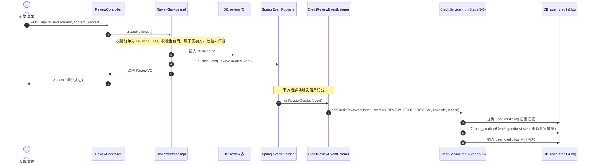

# Stage 5-C: 评价系统与信用领域联动设计方案

> **文档标识**：`docs/stage5/Stage5-C-review-credit-linkage.md`  
> **阶段**：Stage 5-C（评价系统设计与信用联动）  
> **性质**：领域间集成与防刷风控技术规格书  

---

## 一、星级评分与信用积分映射矩阵

为了契合校园二手交易对信用评级的精细化要求，严禁“一刀切”式将所有评价归为简单的好/差评，而是采用**阶梯式加权星级积分映射机制**：

| 星级 | 体验等级 | 信用分变动 (`score_delta`) | 信用领域变更类型 (`change_type`) | 档案计数指标影响 | 业务解释 |
| :---: | :---: | :---: | :---: | :---: | :--- |
| ⭐⭐⭐⭐⭐ **(5星)** | 非常满意 | **+3 分** | `CreditChangeType.REVIEW_GOOD` | `good_review_count + 1` | 交易体验极佳，商品完全相符，面交守时，强烈推荐 |
| ⭐⭐⭐⭐ **(4星)** | 满意 | **+1 分** | `CreditChangeType.REVIEW_GOOD` | `good_review_count + 1` | 交易体验良好，履约正常，轻微瑕疵已提前沟通 |
| ⭐⭐⭐ **(3星)** | 一般 | **0 分** | 无变动（不调信用分） | 计数不增减 | 交易平淡，无明显突出点亦无实质违约，不奖不惩 |
| ⭐⭐ **(2星)** | 较差 | **-2 分** | `CreditChangeType.REVIEW_BAD` | `bad_review_count + 1` | 迟到严重、沟通体验较差、商品成色存在隐瞒瑕疵 |
| ⭐ **(1星)** | 极差 | **-5 分** | `CreditChangeType.REVIEW_BAD` | `bad_review_count + 1` | 严重虚假描述、态度恶劣、甚至疑似校园恶意放鸽子 |

---

## 二、领域事件驱动集成架构

---

## 三、`user_credit_log` 审计流水规范

每一笔评价引发的信用分变动，均通过 Stage 5-B 建设的 `CreditService` 统一沉淀入 `campus_trade.user_credit_log` 表：

| 字段 | 填报规则 | 示例值 |
| :--- | :--- | :--- |
| `user_id` | 被评价人 ID (`reviewed_user_id`) | `10023` |
| `change_type` | `REVIEW_GOOD` 或 `REVIEW_BAD` | `'REVIEW_GOOD'` |
| `change_score` | 对应分值（正整数或负整数） | `+3`（5星）或 `-5`（1星） |
| `before_score` | 变动前信用分快照 | `102` |
| `after_score` | 变动后信用分快照（受 0~200 钳位保护） | `105` |
| `related_type` | 固定为 `'REVIEW'` | `'REVIEW'` |
| `related_id` | 评价实体主键 ID (`review.id`) | `3001` |
| `reason` | 人类可读详细变动溯源文案 | `"来自订单 ORD20260917001 的买家 5 星优质好评"` |
| `created_time` | 流水入库时间戳 | `2026-09-17 23:45:00` |

---

## 四、安全防刷与对敲风控规则

针对校园交易中可能出现的“小号对买对评刷信用分”黑产场景，在 `CreditReviewEventListener` 中前置配置**三重风控闸口**：

### 1. 物理级幂等防重
- 基于 `uk_credit_log_idempotent (user_id, related_type, related_id, change_type)`：
- 同一个 `review_id` 绝对无法被二次计算信用，彻底免疫重复投递或网络重发。

### 2. 关联交易双方加分频控（防对敲刷分）
- **规则**：**同一买家与同一卖家之间，自然周（7 天内）仅允许前 1 次好评计入信用加分**。
- **业务表现**：7 天内后续第 2 笔、第 3 笔订单仍可正常发表评价并公开展示（保障商品真实反馈），但信用监听器检测到双方近期已有评价加分记录，跳过调用 `CreditService`，并在日志中输出 `SKIPPED_PAIR_WEEKLY_LIMIT`。

### 3. 单日评价信用增量硬上限
- **规则**：单个用户自然日内（00:00 ~ 23:59），通过“获得好评”累积增加的信用分上限为 **6 分**（即最多生效 2 个 5 星好评加分）。
- **目的**：防止批量低价小商品（如 0.1 元转让草稿纸）在短时间内暴力冲顶信用极好等级（EXCELLENT）。

### 4. 评价删除与屏蔽不回流加分
- 若某条好评因违规被管理员置为 `AUDIT_REJECTED` 屏蔽，该操作不重新触发好评逻辑，管理员可按实际违规情况手工执行 `ADMIN_ADJUST` 予以追缴。
