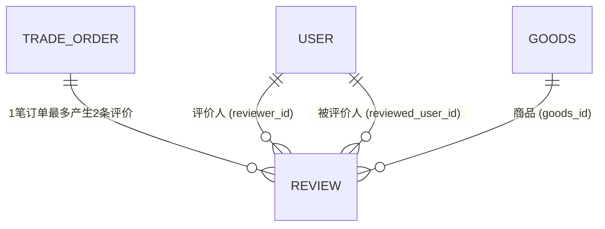

# Stage 5-C: 评价系统数据库架构设计方案 (Flyway V6 规划草案)

> **文档标识**：`docs/stage5/Stage5-C-review-database-design.md`  
> **阶段**：Stage 5-C（评价系统设计与信用联动）  
> **状态**：设计审查草案（禁止在 Stage 5-C 中创建或执行 migration 文件）  

---

## 一、核心数据表设计：`campus_trade.review`

### 1.1 表结构字段详案
```sql
CREATE TABLE IF NOT EXISTS campus_trade.review (
    id BIGSERIAL PRIMARY KEY,
    order_id BIGINT NOT NULL,
    goods_id BIGINT NOT NULL,
    reviewer_id BIGINT NOT NULL,
    reviewed_user_id BIGINT NOT NULL,
    score SMALLINT NOT NULL,
    content VARCHAR(500),
    tags VARCHAR(255),
    is_anonymous BOOLEAN NOT NULL DEFAULT FALSE,
    status VARCHAR(30) NOT NULL DEFAULT 'VISIBLE',
    created_time TIMESTAMP NOT NULL DEFAULT CURRENT_TIMESTAMP,
    updated_time TIMESTAMP NOT NULL DEFAULT CURRENT_TIMESTAMP,
    CONSTRAINT chk_review_score_range CHECK (score >= 1 AND score <= 5)
);
```

### 1.2 字段说明表
| 字段名 | 类型 | 可为空 | 默认值 | 约束说明 | 作用 |
| :--- | :--- | :--- | :--- | :--- | :--- |
| `id` | `BIGSERIAL` | NO | 序列自增 | PRIMARY KEY | 评价全局唯一标识主键 |
| `order_id` | `BIGINT` | NO | - | 关联 `trade_order.id` | 交易履约源头订单 |
| `goods_id` | `BIGINT` | NO | - | 关联 `goods.id` | 交易商品标识 |
| `reviewer_id` | `BIGINT` | NO | - | 关联 `user.id` | 评价发起方用户ID |
| `reviewed_user_id` | `BIGINT` | NO | - | 关联 `user.id` | 被评价方用户ID |
| `score` | `SMALLINT` | NO | - | CHECK(1~5) | 星级评分 (1: 极差 ~ 5: 非常满意) |
| `content` | `VARCHAR(500)` | YES | NULL | 最大500字 | 用户主观图文评价内容 |
| `tags` | `VARCHAR(255)` | YES | NULL | JSON或逗号隔开 | 常用快捷评价标签（如“守时,物美价廉”） |
| `is_anonymous` | `BOOLEAN` | NO | FALSE | 布尔开关 | 前台是否对非本人脱敏隐藏昵称头像 |
| `status` | `VARCHAR(30)` | NO | 'VISIBLE' | VISIBLE / AUDIT_REJECTED | 评价公网可见性状态 |
| `created_time` | `TIMESTAMP` | NO | CURRENT_TIMESTAMP | - | 评价发表时间 |
| `updated_time` | `TIMESTAMP` | NO | CURRENT_TIMESTAMP | - | 评价最后变更时间 |

---

## 二、索引拓扑设计



### 2.1 物理防重唯一索引（核心）
```sql
CREATE UNIQUE INDEX IF NOT EXISTS uk_review_order_reviewer 
    ON campus_trade.review (order_id, reviewer_id);
```
- **核心职能**：确保**同笔订单同一人仅能评价一次**。
- 彻底封死并发网络重试、脚本刷单导致的多条评价产生，从数据库底层构建绝对防线。

### 2.2 高频业务查询索引
```sql
-- 1. 用户信用主页：查询某用户收到的所有可见评价列表 (按时间倒序)
CREATE INDEX IF NOT EXISTS idx_review_target_time 
    ON campus_trade.review (reviewed_user_id, status, created_time DESC);

-- 2. 商品详情页：查询某件二手商品历史获得的所有评价 (按时间倒序)
CREATE INDEX IF NOT EXISTS idx_review_goods_status 
    ON campus_trade.review (goods_id, status, created_time DESC);

-- 3. 订单详情页：查询某笔订单买卖双方已发表的评价
CREATE INDEX IF NOT EXISTS idx_review_order 
    ON campus_trade.review (order_id);
```

---

## 三、衍生表边界评估与延期决议

在需求分析阶段，团队评估了是否需要提前引入 `review_like`（评价点赞）与 `review_report`（评价举报）数据表：

| 评估对象 | 业务场景 | 复杂度与依赖 | 决策结论 |
| :--- | :--- | :--- | :--- |
| **`review_like`（评价点赞）** | 浏览他人评价时点赞互动 | 属于典型的 Stage 6 社区社交互动能力；与当前“交易履约-信用闭环”无强依赖关系，引入会增加表结构碎片。 | ⏸️ **明确延期至 Stage 6（社交增强）** |
| **`review_report`（评价举报）** | 用户对恶意侮辱差评发起举报并流转至审核队列 | 需要配套完整的“工单中心、审核流转状态机、运营后台系统”，超出当前阶段轻量级校园二手闭环范畴。当前争议可通过已预留的 `CreditChangeType.ADMIN_ADJUST` 进行客服人工修正。 | ⏸️ **明确延期至 Stage 6+（平台治理与审核）** |

---

## 四、Flyway V6 规划完整 SQL 草案（评审用）

```sql
-- ==============================================================================
-- Flyway Migration V6: Stage 5-D 评价系统核心表与索引 (DRAFT ONLY - 仅供评审)
-- ==============================================================================

-- 1. 创建评价核心数据表
CREATE TABLE IF NOT EXISTS campus_trade.review (
    id BIGSERIAL PRIMARY KEY,
    order_id BIGINT NOT NULL,
    goods_id BIGINT NOT NULL,
    reviewer_id BIGINT NOT NULL,
    reviewed_user_id BIGINT NOT NULL,
    score SMALLINT NOT NULL,
    content VARCHAR(500),
    tags VARCHAR(255),
    is_anonymous BOOLEAN NOT NULL DEFAULT FALSE,
    status VARCHAR(30) NOT NULL DEFAULT 'VISIBLE',
    created_time TIMESTAMP NOT NULL DEFAULT CURRENT_TIMESTAMP,
    updated_time TIMESTAMP NOT NULL DEFAULT CURRENT_TIMESTAMP,
    CONSTRAINT chk_review_score_range CHECK (score >= 1 AND score <= 5)
);

-- 2. 物理防重唯一索引
CREATE UNIQUE INDEX IF NOT EXISTS uk_review_order_reviewer 
    ON campus_trade.review (order_id, reviewer_id);

-- 3. 业务高频查询索引
CREATE INDEX IF NOT EXISTS idx_review_target_time 
    ON campus_trade.review (reviewed_user_id, status, created_time DESC);

CREATE INDEX IF NOT EXISTS idx_review_goods_status 
    ON campus_trade.review (goods_id, status, created_time DESC);

CREATE INDEX IF NOT EXISTS idx_review_order 
    ON campus_trade.review (order_id);

-- 4. 表与字段注释
COMMENT ON TABLE campus_trade.review IS '交易订单互评数据表';
COMMENT ON COLUMN campus_trade.review.order_id IS '关联交易订单ID';
COMMENT ON COLUMN campus_trade.review.goods_id IS '关联商品ID';
COMMENT ON COLUMN campus_trade.review.reviewer_id IS '评价人用户ID';
COMMENT ON COLUMN campus_trade.review.reviewed_user_id IS '被评价人用户ID';
COMMENT ON COLUMN campus_trade.review.score IS '评分星级 (1~5 星)';
COMMENT ON COLUMN campus_trade.review.status IS '评价状态: VISIBLE(展示), AUDIT_REJECTED(违规屏蔽)';
```
