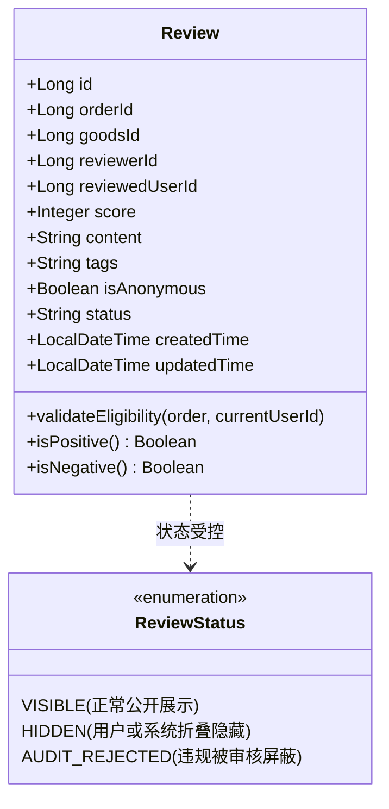

# Stage 5-C: 评价领域模型与业务规则设计方案

> **文档标识**：`docs/stage5/Stage5-C-review-domain-design.md`  
> **阶段**：Stage 5-C（评价系统设计与信用联动）  
> **性质**：领域驱动设计 (DDD) 规格说明书  

---

## 一、评价聚合根模型 (Review Aggregate)

### 1.1 核心字段规范与必要性分析

| 字段名称 | 推荐类型 | 不可修改性 | 快照/引用 | 为什么需要此字段？（业务价值与设计意图） |
| :--- | :--- | :--- | :--- | :--- |
| `id` | `Long` (BIGSERIAL) | **永久不可变** | 唯一标识 | 聚合根主键，分布式或全局唯一寻址，供信用流水与后续互动追溯。 |
| `order_id` | `Long` (BIGINT) | **永久不可变** | 引用关联 | 评价的法律依据。确保每一笔评价必须有实体订单履约作为事实源，杜绝刷空单。 |
| `goods_id` | `Long` (BIGINT) | **永久不可变** | 引用关联 | 关联交易商品，用于在商品详情页聚合展示历史买家对该商品的真实评价。 |
| `reviewer_id` | `Long` (BIGINT) | **永久不可变** | 身份标识 | 评价发起人（买家或卖家）。权限校验、防重复评价及风控核验的核心字段。 |
| `reviewed_user_id` | `Long` (BIGINT) | **永久不可变** | 身份标识 | 评价承受方（被评价人）。信用积分加减与评价聚合的归属主体。 |
| `score` | `Integer` (1~5) | **永久不可变** | 核心指标 | 量化星级评分（1~5星）。直接驱动信用域执行对应正负积分计算的核心指标。 |
| `content` | `String` (0~500) | **永久不可变** | 文本描述 | 用户主观交易体验描述（如成色是否符合描述、面交是否守时）。 |
| `tags` | `String` (JSON/逗号) | **永久不可变** | 结构化标签 | 快速评价标签（如“守时诚信”、“成色极佳”、“沟通愉快”）。降低评价成本。 |
| `is_anonymous` | `Boolean` | **永久不可变** | 隐私策略 | 是否前台匿名展示。保护校园社交隐私，避免面交后尴尬。 |
| `status` | `String` (枚举) | 可由系统变更为屏蔽 | 状态生命周期 | 评价状态控制：`VISIBLE`（正常展示）、`AUDIT_REJECTED`（违规屏蔽）。 |
| `created_time` | `LocalDateTime` | **永久不可变** | 时间审计 | 评价发布时间戳，用于时序排序与有效性审计。 |
| `updated_time` | `LocalDateTime` | 变动记录 | 时间审计 | 状态发生变化（如管理员治理屏蔽）时的最后更新时间。 |

---

### 1.2 不可修改字段与快照设计原则
1. **绝对不可修改原则**：  
   `order_id`、`goods_id`、`reviewer_id`、`reviewed_user_id`、`score`、`created_time` 在落库后**严禁任何修改**。
   - **设计理由**：若允许修改星级（如从 1 星改成 5 星），将极大增加信用体系的复杂度（涉及历史信用回滚、流水撤销、防套利对冲），并滋生“差评勒索-改好评收钱”的黑灰产行为。
2. **轻量快照原则**：  
   前端展示评价时，通过商品 ID / 用户 ID 读取当前头像与昵称（或匿名脱敏）；若商品被物理下架或删除，评价记录中保存的 `goods_id` 与对应订单快照依然可完整还原当时交易上下文。

---

## 二、校园二手交易评价业务规则体系

### 2.1 评价准入规则（Who & When）
1. **严格基于履约事实**：
   - 只有订单状态为 `OrderStatus.COMPLETED` 的订单允许创建评价。
   - 处于 `WAIT_SELLER_CONFIRM`、`WAIT_MEET`、`CANCELLED` 状态的订单无评价权。
2. **双向互评权限**：
   - 买家评价卖家：`reviewer_id = order.buyerId`，`reviewed_user_id = order.sellerId`；
   - 卖家评价买家：`reviewer_id = order.sellerId`，`reviewed_user_id = order.buyerId`；
   - **严禁第三方代评**：当前登录用户 ID 必须等于 `order.buyerId` 或 `order.sellerId`，否则抛出 `403 Forbidden`。
   - **严禁自买自评**：已由订单系统天然拦截（`buyerId != sellerId`）。
3. **时效性约束（7 天生命周期窗口）**：
   - 评价窗口：`order.completedTime` 之后的 **7 天（168 小时）内**。
   - **理由**：线下二手面交体验记忆随时间迅速衰减，超过 7 天后极易产生恶意翻旧账或不可查证的纠纷。超时后订单自动关闭评价通道，状态置为“已失效/默认好评（若有自动机制）”。

---

### 2.2 匿名评价深度权衡分析

| 方案 | 前台展示 | 后台存储与风控 | 利弊权衡与业务影响 | 最终结论 |
| :--- | :--- | :--- | :--- | :--- |
| **完全实名** | 完整显示学号学院、真实昵称与头像 | 记录真实用户 | 优点：评价极其严谨，利于熟人诚信； 缺点：校园熟人社会下，买家遇到差评不敢真实打分，害怕被卖家线下找麻烦。 | ❌ 过于激进 |
| **完全匿名（暗箱）** | 匿名展示 | 后台不记录真实身份 | 优点：用户无压力； 缺点：信用无法结算，恶意差评泛滥，无法问责。 | ❌ 坚决杜绝 |
| **前端伪匿名 + 后台强实名（推荐）** | 勾选匿名后，公网前台显示为“校友***”、默认灰色头像 | **数据库与信用流水严格关联真实 `reviewer_id`** | ① 消除用户在校园给出客观差评的心理包袱； ② 后台与风控依然具备 100% 可追溯性； ③ 信用积分与防刷限制照常精确生效。 | ✅ **采纳方案** |

---

### 2.3 评价修改与删除策略决策
- **评价一经提交，永久不可修改、不可由用户自主删除**：
  - **原因**：防止卖家以私下转账、退款为诱饵要求买家改评；杜绝恶意买家给出 1 星差评勒索卖家赠送物品。
  - **争议救济通道**：若确有恶意侮辱诽谤或误评，当事人可向管理员发起申诉。管理员核实后可通过后台操作将该评价状态置为 `AUDIT_REJECTED` 并发起人工信用调账（`ADMIN_ADJUST`），保留完整审计依据。

---

### 2.4 数据库级物理防重评价保障
- 业务代码层在写库前先检查 `SELECT count(*) WHERE order_id = ? AND reviewer_id = ?`；
- **底层物理硬约束**：在数据库建立唯一约束 `UNIQUE (order_id, reviewer_id)`。
- **效果**：无论前端如何快速连续点击，或者恶意脚本并发重放，同一订单的同一用户在数据库层面有且仅能落库 1 条评价记录。
