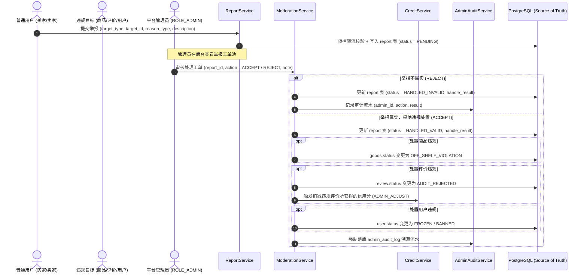

# Stage 6-A：高级互动与平台治理体系——现状审查、需求边界与技术设计规范

**编制日期**：2026-09-18  
**所属阶段**：Stage 6-A（高级互动与平台治理体系——审查与设计）  
**工程约束**：**只审查 + 只设计，禁止实现任何业务代码**  
**指导原则**：读取现状 → 盘点 Deferred Items → 识别真实需求 → 发现设计风险 → 形成完整设计 → 设计评审 → Gate → 停止

---

## 目录
- [一、Stage 0～5 现有系统架构全景图 (Architecture Map)](#一stage-05-现有系统架构全景图-architecture-map)
- [二、Stage 6 候选功能重新盘点与必要性评估](#二stage-6-候选功能重新盘点与必要性评估)
- [三、主动 Push Back 专项论证 (拒绝实现功能与理由)](#三主动-push-back-专项论证-拒绝实现功能与理由)
- [四、Stage 6 采纳核心功能范围与阶段划分](#四stage-6-采纳核心功能范围与阶段划分)
- [五、技术设计一：平台内容治理体系 (Report, Moderation, Audit)](#五技术设计一平台内容治理体系-report-moderation-audit)
- [六、技术设计二：统一举报工单系统 (Report Domain)](#六技术设计二统一举报工单系统-report-domain)
- [七、技术设计三：评价点赞与社区互动增强 (Review Like Domain)](#七技术设计三评价点赞与社区互动增强-review-like-domain)
- [八、技术设计四：管理员治理与操作审计体系 (Admin & Audit Domain)](#八技术设计四管理员治理与操作审计体系-admin--audit-domain)
- [九、技术设计五：三层混合内容审核模型 (Moderation Architecture)](#九技术设计五三层混合内容审核模型-moderation-architecture)
- [十、Stage 6 数据库迁移规划 (Flyway V7)](#十stage-6-数据库迁移规划-flyway-v7)
- [十一、Stage 6 风险分析与防范预案](#十一stage-6-风险分析与防范预案)
- [十二、Stage 6-A 阶段评审与 Gate 放行建议](#十二stage-6-a-阶段评审与-gate-放行建议)

---

## 一、Stage 0～5 现有系统架构全景图 (Architecture Map)

在进入 Stage 6 之前，通过对全站代码、数据库迁移与测试用例进行全面扫描，梳理当前 CampusTrade 已落地的能力矩阵，**严禁在 Stage 6 重复造轮子**：

```mermaid
graph TD
    subgraph S1["Stage 1: 用户中心与校园认证"]
        U["campus_trade.user (JWT 认证 / BCrypt)"]
        SC["campus_school (高校字典)"]
        SV["student_verify (实名邮箱验证码)"]
        UC["user_credit (初始基准100分)"]
    end

    subgraph S2["Stage 2: 商品发布与分类浏览"]
        CAT["category (二级层级树)"]
        G["goods (ON_SALE / LOCKED / SOLD / OFF_SHELF)"]
        GI["goods_image (MinIO 对象存储)"]
        GT["goods_tag (标签分类)"]
    end

    subgraph S3["Stage 3 & 3.5: 互动、足迹与 AI 助手"]
        FAV["favorite (uk_user_goods + Redis 计数)"]
        BH["browse_history (足迹逆序)"]
        SH["search_history (DB真理源 + Redis ZSet热搜)"]
        AI["DeepSeekClient (标题润色 / 智能估价 / 标签生成)"]
    end

    subgraph S4["Stage 4: 交易订单与状态机闭环"]
        ORD["trade_order (WAIT_SELLER_CONFIRM -> WAIT_MEET -> COMPLETED)"]
        SM["OrderStateMachine (白盒不可逆校验)"]
        UKO["uk_trade_order_active_goods (防超卖部分索引)"]
    end

    subgraph S5["Stage 5: 信用领域与交易评价闭环"]
        UCL["user_credit_log (uk_credit_log_idempotent 强幂等流水)"]
        CS["CreditService (addCredit / deductCredit, 0~200 钳位, 4级等级)"]
        REV["review (1~5星, 168h有效窗口, uk_review_order_reviewer)"]
        EVT["ReviewCreatedEvent -> CreditReviewEventListener (领域事件驱动)"]
        FLT["Flutter 前端评价弹窗 + 信用中心卡片展示"]
    end

    S1 --> S2 --> S3 --> S4 --> S5
```



---

## 二、Stage 6 候选功能重新盘点与必要性评估

针对 Stage 5-E 延期清单及平台运营演进诉求，对 12 项潜在功能进行深度评审，明确功能价值、复杂度与可行性：

| 序号 | 候选功能项 | 业务价值 | 实现复杂度 | 数据模型影响 | 权限影响 | 安全风险 | Redis 影响 | 前后端改动量 | 测试成本 | **评估结论** |
|:---:|:---|:---|:---:|:---:|:---:|:---:|:---:|:---:|:---:|:---:|
| 1 | **评价点赞 (`review_like`)** | 中。识别优质评价，社区氛围建设 | 低 | 新增 `review_like`，`review` 扩充 `like_count` | 登录用户即可操作 | 低 (并发刷赞防范) | 仅做去重与计数加速，DB 为真理源 | 前端加点赞动效，后端提供 Toggle 接口 | 低 | **✅ 采纳纳入 Stage 6** |
| 2 | **评价举报 (`review_report`)** | 极高。遏制恶意差评、人身攻击、广告垃圾 | 中 | 纳入统一 `report` 体系 | 买卖双方发起，管理员处理 | 低 (需频控防恶意举报) | 防刷限频计数 | 前端增加举报弹窗，后端工单处理 | 中 | **✅ 采纳纳入 Stage 6** |
| 3 | **商品举报 (`goods_report`)** | 极高。下架涉黄涉暴、假冒违禁、虚假价格商品 | 中 | 纳入统一 `report` 体系 | 任意买家发起，管理员处理 | 低 (防恶意批量下架同行) | 防刷限频计数 | 商品详情页增加举报入口 | 中 | **✅ 采纳纳入 Stage 6** |
| 4 | **用户举报 (`user_report`)** | 高。打击频繁放鸽子、私下诈骗、骚扰行为 | 中 | 纳入统一 `report` 体系 | 登录用户发起，管理员处理 | 低 | 防刷限频计数 | 用户主页/个人资料增加举报入口 | 中 | **✅ 采纳纳入 Stage 6** |
| 5 | **评价修改与自主删除** | 负向。严重破坏信用评价公信力与幂等流水 | 高 | 严重破坏信用模型 | 滋生私下威逼利诱篡改评价 | 极高 (信誉被操纵) | 无 | 前后端大量返工 | 高 | **❌ 坚决 Push Back (拒绝)** |
| 6 | **商品违规下架与评价违规屏蔽** | 极高。治理体系闭环动作，落实合规监管 | 中 | 扩展状态 `OFF_SHELF_VIOLATION` 与 `AUDIT_REJECTED` | 仅限管理员操作 | 中 (需操作审计追溯) | 违规下架需主动清理缓存 | 前端展示封禁/下架标识 | 中 | **✅ 采纳纳入 Stage 6** |
| 7 | **管理员治理工作台与审计日志** | 极高。工单审核、违规下架、信用追缴操作留痕 | 中 | 新增 `admin_audit_log` 审计流水表 | 严格校验 `ROLE_ADMIN` | 高 (防越权管理) | 无 | 后端提供管控 API，提供安全拦截 | 中 | **✅ 采纳纳入 Stage 6** |
| 8 | **线上支付与资金存管 (Escrow Payment)** | 伪需求。无金融支付牌照，违背面交轻量场景 | 极高 | 摧毁 Stage 4 稳定状态机 | 涉资安全合规红线 | 极高 (资金池/漏洞) | 分布式锁与对账 | 前后端全盘推翻重构 | 极高 | **❌ 坚决 Push Back (拒绝)** |
| 9 | **即时聊天 / WebSocket IM** | 中高。但同校面交主要靠地点与留言约定 | 极高 | 新增 3 张消息与会话表 | 双向长连接鉴权 | 高 (长连接风暴/广播) | 会话状态/未读计数 | 需重写完整移动端聊天界面 | 极高 | **❌ 坚决 Push Back (延期至 Stage 7)** |
| 10 | **三层混合内容审核 (DFA+AI+人工)** | 极高。主动防范违法乱纪文本在校园传播 | 中 | 敏感词字典与审核标记 | 系统前置拦截 | 低 | 敏感词 Trie 树缓存 | 前端输入时友好拦截提示 | 中 | **✅ 采纳纳入 Stage 6** |
| 11 | **评价图片/视频多媒体上传** | 中。图片辅助验货口碑 | 中高 | 新增 `review_image` 表 | 上传防刷/鉴黄 | 中 (违规图片传播) | 无 | 前端需开发九宫格图片选择器 | 中 | **❌ 建议延期至 Stage 6 后续演进** |
| 12 | **追评与商家回复 (Reply)** | 中。解决双方误会 | 中 | `review` 增加父子评价关联 | 需保证不可反复盖楼 | 低 | 无 | 前端展示嵌套列表 | 中 | **❌ 建议延期至 Stage 6 后续演进** |

---

## 三、主动 Push Back 专项论证 (拒绝实现功能与理由)

作为专业系统架构师，绝不能盲目堆砌功能，必须针对以下三项高风险需求主动提出明确的 **Push Back**：

### 1. 坚决 Push Back：线上支付与资金存管（Online Escrow Payment）
- **核心论据一：违背高校交易的本质特征**  
  高校二手物品交易发生在同一校园或相邻寝室区，天然具备“面对面看货、实地验机、一手交钱一手交货”的信任环境。买家现场通过微信/支付宝直接转账给卖家，零手续费且零延迟。
- **核心论据二：触碰国家金融监管与合规红线**  
  若平台介入资金流（买家付款给平台，面交完成后平台结算给卖家），属于典型的“资金二清”行为。根据中国人民银行与《电子商务法》规定，无支付牌照从事资金结算属于违法违规。平台不具备申请支付业务许可证与银行资金存管体系的条件。
- **核心论据三：灾难性的状态机侵入**  
  Stage 4 建立的订单状态机（`WAIT_SELLER_CONFIRM` -> `WAIT_MEET` -> `COMPLETED`）经受了 150 个单元测试的严密验证。强行接入线上支付将引入 `WAIT_PAY`, `PAY_EXPIRED`, `REFUNDING`, `REFUNDED` 等一系列分布式异步分支，并涉及对账、掉单、补单、退款争端等极其复杂的分布式事务场景，得不偿失。
- **裁决结论**：**Stage 6 坚决不引入线上支付**。平台坚守“信息撮合 + 信用评价 + 面交履约确认”的安全轻量定位。

### 2. 坚决 Push Back：WebSocket 实时即时通讯（IM）
- **核心论据一：工程研发与运维复杂度超出当前阶段承载力**  
  真正的生产级 IM 需要解决连接保活（Heartbeat Ping/Pong）、弱网重连、消息 ACK 确认机制、离线消息持久化与拉取、端到端未读红点同步、消息撤回等大量分布式通信问题。
- **核心论据二：已有机制已充分满足沟通刚需**  
  Stage 4 订单已支持 `meetLocation`（面交地点）、`buyerMessage`（买家留言）、`sellerReply`（卖家回复），加之用户在商品详情页可查看卖家绑定的手机号/微信号等联系方式，对于“约定在几号楼或食堂门口见面”的校园场景已完全够用。
- **裁决结论**：**Stage 6 坚决不引入 WebSocket IM**，延期至 Stage 7 作为独立即时通讯子系统进行技术选型与规划。

### 3. 坚决 Push Back：普通用户自主修改与删除评价
- **核心论据一：杜绝利用改评/删评操纵信用积分**  
  二手交易评价是平台信用分（`UserCredit`）与信誉档案的基石。如果允许用户随意修改或删除评价，将直接引发严重道德风险——例如“买家收受卖家私下返利后删除差评”，或者“买家给出好评获得信用加分后，隔日恶意篡改差评”。
- **核心论据二：破坏已有的强幂等审计流水体系**  
  Stage 5-B/5-D 建设的 `CreditService` 与 `user_credit_log` 具备物理唯一索引 `uk_credit_log_idempotent`。若允许自由改评或删评，会导致已入账的信用流水面临复杂的回退/追缴/冲正逻辑，极易产生坏账或分值混乱。
- **裁决结论**：**维持 Stage 5 确立的“评价一次性提交、永久生效、普通用户禁止编辑和删除”的铁律**。仅支持在收到违规举报后，由管理员介入执行官方审核下架（`AUDIT_REJECTED`）并生成 `ADMIN_ADJUST` 追缴流水。

---

## 四、Stage 6 采纳核心功能范围与阶段划分

经严格审查与边界收敛，Stage 6 最终确立聚焦于 **三大核心治理体系 + 一项社区轻量互动**：

```text
Stage 6 落地范围：
├── 1. 统一举报系统 (Report Domain) ───────── 商品举报 + 评价举报 + 用户举报 (统一工单)
├── 2. 平台内容治理 (Moderation Domain) ───── 违规商品下架 + 违规评价屏蔽 + 信用追缴
├── 3. 管理员鉴权与审计 (Admin & Audit) ───── ROLE_ADMIN 安全收口 + admin_audit_log 溯源
└── 4. 评价点赞互动 (Review Like Domain) ──── 优质评价点赞 + 物理防重 + PostgreSQL真理源
```

### Stage 6 阶段落地执行规划
- **Stage 6-A（当前阶段）**：现状审查、需求边界收敛、Push Back 论证与全套技术架构设计规范（只设计不写代码）；
- **Stage 6-B**：举报系统与管理员治理后端实现（Flyway V7 迁移、`Report`、`AdminAuditLog`、Controller、Service、单元测试）；
- **Stage 6-C**：评价点赞与违规状态机联动后端实现（`ReviewLike`、点赞计数、违规下架与信用追缴联动、单元测试）；
- **Stage 6-D**：Flutter 前端治理与互动交互落地（举报弹窗、点赞按钮与动画、违规状态呈现、个人中心治理感知）；
- **Stage 6-E**：Stage 6 全链路端到端回归验收与最终放行 Gate。

---

## 五、技术设计一：平台内容治理体系 (Report, Moderation, Audit)

在架构设计上，理清 **举报 (Report)**、**审核治理 (Moderation)** 与 **操作审计 (Audit)** 的领域关系：



---

## 六、技术设计二：统一举报工单系统 (Report Domain)

### 1. `target_type` 方案选型深度对比

| 对比维度 | 方案 A：统一 `campus_trade.report` 表 (推荐) | 方案 B：拆分为 3 张独立表 (`goods_report`, `review_report`, `user_report`) |
|:---|:---|:---|
| **数据模型统一性** | **高**。所有举报均为“工单”，共享相同的流转状态与审核属性 | **低**。模型碎片化，存在大量重复列（`reporter_id`, `status`, `handled_by` 等） |
| **后台工单管理复杂度** | **极低**。单个分页接口 `GET /api/admin/reports` 即可支持按时间、按状态全量拉取工单池 | **极高**。需要分别写 3 套 Controller、3 套 Service、3 套 Mapper，或进行复杂的 SQL UNION |
| **扩展性** | **优**。未来新增 `POST_REPORT`（论坛/帖子举报）只需扩充枚举值，无需改表结构 | **差**。每增加一种可举报业务实体，都必须进行一次 DDL 迁移新增表 |
| **外键完整性** | 弱（多态关联无法设置物理 FOREIGN KEY，需靠应用层校验存在性） | 强（可直接针对 `goods_id`, `review_id` 设物理外键） |
| **架构决策** | **采纳方案 A**：外键完整性由 Service 层严密校验；统一模型带来的研发与运维收益远大于拆表。 | 否决方案 B。 |

### 2. `campus_trade.report` 表结构技术设计

```sql
CREATE TABLE IF NOT EXISTS campus_trade.report (
    id BIGSERIAL PRIMARY KEY,
    reporter_id BIGINT NOT NULL,
    target_type VARCHAR(30) NOT NULL,
    target_id BIGINT NOT NULL,
    reason_type VARCHAR(50) NOT NULL,
    description VARCHAR(500),
    evidence_images VARCHAR(1000),
    status VARCHAR(30) NOT NULL DEFAULT 'PENDING',
    handled_by BIGINT,
    handled_time TIMESTAMP,
    handle_result VARCHAR(500),
    created_time TIMESTAMP NOT NULL DEFAULT CURRENT_TIMESTAMP,
    updated_time TIMESTAMP NOT NULL DEFAULT CURRENT_TIMESTAMP,
    CONSTRAINT chk_report_target_type CHECK (target_type IN ('GOODS', 'REVIEW', 'USER')),
    CONSTRAINT chk_report_status CHECK (status IN ('PENDING', 'HANDLED_VALID', 'HANDLED_INVALID'))
);
```

### 3. 索引与防刷设计
- **防同一用户对同一目标未结工单重复举报（物理防重）**：
  ```sql
  CREATE UNIQUE INDEX IF NOT EXISTS uk_report_active 
      ON campus_trade.report (reporter_id, target_type, target_id) 
      WHERE status = 'PENDING';
  ```
  *业务规则*：只要上一次举报处于 `PENDING`（审核中），同一用户再次举报相同目标直接返回 `409 Conflict ("该目标您已提交举报，管理员正在核查中")`。
- **查询与工单流水索引**：
  ```sql
  CREATE INDEX IF NOT EXISTS idx_report_status_time 
      ON campus_trade.report (status, created_time DESC);
  CREATE INDEX IF NOT EXISTS idx_report_target 
      ON campus_trade.report (target_type, target_id);
  ```
- **业务层限频防护（Redis Token Bucket / Counter）**：
  - 单个用户自然日内累计提交举报上限为 **10 次**；
  - Redis 键：`report:daily:limit:{userId}:{yyyyMMdd}`，超限抛出 `429 Too Many Requests ("您今日举报次数已达上限，请明天再试")`；
  - 严禁举报自己：商品卖家不能举报自己的商品，评价者不能举报自己的评价，用户不能举报自己。

---

## 七、技术设计三：评价点赞与社区互动增强 (Review Like Domain)

### 1. 点赞持久化与真理源铁律
根据平台 Stage 3.5-A 确定的 **PostgreSQL = Source of Truth，Redis = Cache** 原则：
- 严禁将点赞数仅存储在 Redis 中（防止缓存击穿或重启数据丢失）；
- 严禁每次分页查询都执行高开销的 `SELECT COUNT(*)`（避免随着评价量增加引发数据库性能雪崩）。
- **标准设计**：
  1. `campus_trade.review` 表新增冗余字段 `like_count INT NOT NULL DEFAULT 0`；
  2. 新增明细表 `campus_trade.review_like` 记录点赞明细，唯一索引物理防重；
  3. 点赞与取消点赞在同一个 `@Transactional` 内完成明细插入/删除与主表 `like_count` 原子累加/扣减（受 `GREATEST(0, like_count - 1)` 保护）。

### 2. `campus_trade.review_like` 表结构设计

```sql
CREATE TABLE IF NOT EXISTS campus_trade.review_like (
    id BIGSERIAL PRIMARY KEY,
    review_id BIGINT NOT NULL,
    user_id BIGINT NOT NULL,
    created_time TIMESTAMP NOT NULL DEFAULT CURRENT_TIMESTAMP
);

-- 核心物理唯一索引 (一人一赞)
CREATE UNIQUE INDEX IF NOT EXISTS uk_review_like_review_user 
    ON campus_trade.review_like (review_id, user_id);

CREATE INDEX IF NOT EXISTS idx_review_like_user 
    ON campus_trade.review_like (user_id, created_time DESC);
```

### 3. API 交互行为设计
- 接口定义：`POST /api/reviews/{id}/like/toggle`（幂等切换：未赞则赞，已赞则取消）；
- 返回结果：`{ "isLiked": true, "likeCount": 12 }`；
- 前端优化：点赞采用乐观更新（UI 立即变红点亮并 +1），若网络异常或服务端报错（如评价已被屏蔽）则静默回滚状态并弹出轻量提示。

---

## 八、技术设计四：管理员治理与操作审计体系 (Admin & Audit Domain)

### 1. 角色与权限体系架构
- 现有 `campus_trade.user.role` 字段已包含 `'USER'`，完全支持扩展 `'ADMIN'`；
- `CustomUserDetailsService` 已内置将 `user.getRole()` 转换为 `ROLE_ADMIN`；
- `SecurityConfig` 规范收口：
  - 路由控制：`.requestMatchers("/api/admin/**", "/admin/**").hasRole("ADMIN")`；
  - 方法注解控制：在管理员专属 Controller 上启用 `@PreAuthorize("hasRole('ADMIN')")`，做到双保险隔离；
  - 严禁普通用户直接调用管理接口（拦截并返回 403 Forbidden）。

### 2. 管理员操作审计流水表 (`campus_trade.admin_audit_log`)

任何管理员针对业务数据的写操作（封禁、下架、屏蔽、扣分）必须**强制生成不可逆的审计流水**：

```sql
CREATE TABLE IF NOT EXISTS campus_trade.admin_audit_log (
    id BIGSERIAL PRIMARY KEY,
    admin_id BIGINT NOT NULL,
    admin_username VARCHAR(50) NOT NULL,
    operation_type VARCHAR(50) NOT NULL,
    target_type VARCHAR(30) NOT NULL,
    target_id BIGINT NOT NULL,
    before_status VARCHAR(50),
    after_status VARCHAR(50),
    reason VARCHAR(500) NOT NULL,
    ip_address VARCHAR(50),
    created_time TIMESTAMP NOT NULL DEFAULT CURRENT_TIMESTAMP
);

CREATE INDEX IF NOT EXISTS idx_admin_audit_time 
    ON campus_trade.admin_audit_log (created_time DESC);

CREATE INDEX IF NOT EXISTS idx_admin_audit_target 
    ON campus_trade.admin_audit_log (target_type, target_id);
```

### 3. 违规评价屏蔽与信用分追缴联动
当管理员判定某条评价属于“恶意虚假刷分”或“人身攻击违规”而将其置为 `AUDIT_REJECTED` 时：
1. `Review` 状态变更为 `AUDIT_REJECTED`，前台公开列表不再展示；
2. 若该评价此前为好评并已使被评人增加了信用分（如 5 星加 3 分），治理服务主动调用：
   ```java
   creditService.deductCredit(
       reviewedUserId,
       3,
       CreditChangeType.ADMIN_ADJUST,
       "REVIEW",
       reviewId,
       "因评价涉嫌违规被平台屏蔽，追缴所获信用分 (管理员操作)"
   );
   ```
3. 生成 `ADMIN_ADJUST` 类型的 `user_credit_log`，实现信用闭环可溯。

---

## 九、技术设计五：三层混合内容审核模型 (Moderation Architecture)

针对商品标题、商品描述、评价正文、举报描述等用户生成内容（UGC），对比分析三种审核方案：

| 维度 | 方案 A：本地敏感词/DFA 算法 | 方案 B：纯 AI 大模型 (DeepSeek) | 方案 C：三层混合审核架构 (推荐采纳) |
|:---|:---|:---|:---|
| **延迟/响应速度** | 极快 (< 1ms)，内存 Trie 树高效匹配 | 较慢 (200ms ~ 1500ms)，受网络与排队影响 | **兼顾极致**：前置发布 < 1ms 即时阻断，深层语义人机协同 |
| **系统稳定性** | 极高 (零外部依赖，100% 可用) | 易受第三方 API 抖动或限流影响可用性 | **极高**：即便外部 AI 宕机，本地规则与人工工单依然稳健运行 |
| **语义理解与变种识别** | 弱（难以识别拼音拆字、隐晦意图） | 极强（上下文理解深刻） | **强**：规则过滤粗暴违规，AI 提供工单辅助分析，人工把控终局 |
| **API 调用成本** | **零成本** | 随着 UGC 规模增长产生持续 Token 计费 | **可控**：仅在举报工单触发或特定可疑判定时调用 AI，成本节约 90% |

### 采纳方案 C 的三层闭环落地规范：
1. **第一层：本地 DFA 词库拦截（发布时同步硬阻断）**  
   维护校园本地敏感词字典（违规联系方式拉客、涉黄、赌博、违禁药物、暴恐），用户在发布商品或提交评价时同步校验。命中直接抛出 `BusinessException(422, "内容包含敏感违规词汇，请修改后重试")`。
2. **第二层：AI 辅助工单研判（审核期按需调用）**  
   当用户提交举报时，系统可调用已有的 `DeepSeekClient` 生成“违规性质判定建议”作为管理员参考，不自动做阻断。
3. **第三层：人工治理终审（管理工作台）**  
   最终下架与封号决策权交由平台管理员人工核验，杜绝 AI 误杀对真实交易的干扰。

---

## 十、Stage 6 数据库迁移规划 (Flyway V7)

计划在后续 Stage 6-B 正式实施时创建 `V7__create_governance_and_interaction_domain.sql`，执行脚本结构预演：

```sql
-- ==============================================================================
-- Flyway Migration V7: Stage 6 高级互动与平台治理领域数据迁移
-- ==============================================================================

-- 1. 评价主表扩充 like_count 冗余计数
ALTER TABLE campus_trade.review 
    ADD COLUMN IF NOT EXISTS like_count INT NOT NULL DEFAULT 0;

-- 2. 创建评价点赞表 (campus_trade.review_like)
CREATE TABLE IF NOT EXISTS campus_trade.review_like (
    id BIGSERIAL PRIMARY KEY,
    review_id BIGINT NOT NULL,
    user_id BIGINT NOT NULL,
    created_time TIMESTAMP NOT NULL DEFAULT CURRENT_TIMESTAMP
);

CREATE UNIQUE INDEX IF NOT EXISTS uk_review_like_review_user 
    ON campus_trade.review_like (review_id, user_id);

CREATE INDEX IF NOT EXISTS idx_review_like_user 
    ON campus_trade.review_like (user_id, created_time DESC);

-- 3. 创建统一举报工单表 (campus_trade.report)
CREATE TABLE IF NOT EXISTS campus_trade.report (
    id BIGSERIAL PRIMARY KEY,
    reporter_id BIGINT NOT NULL,
    target_type VARCHAR(30) NOT NULL,
    target_id BIGINT NOT NULL,
    reason_type VARCHAR(50) NOT NULL,
    description VARCHAR(500),
    evidence_images VARCHAR(1000),
    status VARCHAR(30) NOT NULL DEFAULT 'PENDING',
    handled_by BIGINT,
    handled_time TIMESTAMP,
    handle_result VARCHAR(500),
    created_time TIMESTAMP NOT NULL DEFAULT CURRENT_TIMESTAMP,
    updated_time TIMESTAMP NOT NULL DEFAULT CURRENT_TIMESTAMP,
    CONSTRAINT chk_report_target_type CHECK (target_type IN ('GOODS', 'REVIEW', 'USER')),
    CONSTRAINT chk_report_status CHECK (status IN ('PENDING', 'HANDLED_VALID', 'HANDLED_INVALID'))
);

CREATE UNIQUE INDEX IF NOT EXISTS uk_report_active 
    ON campus_trade.report (reporter_id, target_type, target_id) 
    WHERE status = 'PENDING';

CREATE INDEX IF NOT EXISTS idx_report_status_time 
    ON campus_trade.report (status, created_time DESC);

CREATE INDEX IF NOT EXISTS idx_report_target 
    ON campus_trade.report (target_type, target_id);

-- 4. 创建管理员审计日志表 (campus_trade.admin_audit_log)
CREATE TABLE IF NOT EXISTS campus_trade.admin_audit_log (
    id BIGSERIAL PRIMARY KEY,
    admin_id BIGINT NOT NULL,
    admin_username VARCHAR(50) NOT NULL,
    operation_type VARCHAR(50) NOT NULL,
    target_type VARCHAR(30) NOT NULL,
    target_id BIGINT NOT NULL,
    before_status VARCHAR(50),
    after_status VARCHAR(50),
    reason VARCHAR(500) NOT NULL,
    ip_address VARCHAR(50),
    created_time TIMESTAMP NOT NULL DEFAULT CURRENT_TIMESTAMP
);

CREATE INDEX IF NOT EXISTS idx_admin_audit_time 
    ON campus_trade.admin_audit_log (created_time DESC);

CREATE INDEX IF NOT EXISTS idx_admin_audit_target 
    ON campus_trade.admin_audit_log (target_type, target_id);
```

---

## 十一、Stage 6 风险分析与防范预案

| 风险场景 | 潜在威胁 | 架构级防范预案 |
|:---|:---|:---|
| **恶意刷举报攻击** | 恶意用户批量举报正常卖家，堵塞审核工单池 | 1. 唯一部分索引 `uk_report_active` 杜绝重复提交；<br>2. Redis 自然日 10 次硬限流；<br>3. 恶意虚假举报行为可由管理员实施反向信用扣减。 |
| **点赞并发超频刷数** | 并发调用点赞导致 `like_count` 计数失真或负数 | 1. 唯一索引 `uk_review_like_review_user` 强行阻断；<br>2. SQL 执行 `SET like_count = GREATEST(0, like_count - 1)` 防止出现负计数。 |
| **管理员越权滥用** | 普通用户伪造 Token 篡改 `ROLE_ADMIN` 执行封禁 | 1. Spring Security 全局拦截 `/api/admin/**`；<br>2. Controller 层添加 `@PreAuthorize("hasRole('ADMIN')")`；<br>3. `admin_audit_log` 完整记录操作人 IP、时间与前后快照，支持追责。 |
| **下架导致订单数据孤岛** | 正在交易中的商品被管理员下架引发状态错乱 | 业务规则规定：处于 `WAIT_SELLER_CONFIRM` 或 `WAIT_MEET` 的订单所绑定的商品，下架操作联动触发订单自动关闭并全额退回商品，或仅在完成前标记冻结，保护买卖双方权益。 |

---

## 十二、Stage 6-A 阶段评审与 Gate 放行建议

### 1. 阶段产出完成度自查
- [x] **现有系统全景扫描**：输出 Stage 0～5 架构全景图，无能力重复；
- [x] **候选功能充分盘点**：对 12 项潜在需求完成复杂度、模型与风险逐项剖析；
- [x] **主动 Push Back 落实**：针对支付、WebSocket IM、普通用户自主改删评价给出了深度合理的拒绝论证；
- [x] **统一举报系统技术设计**：完成统一表 vs 拆分表权衡、DDL、部分唯一索引及防刷限流设计；
- [x] **评价点赞技术设计**：确立 PostgreSQL 作为 Source of Truth，一人一赞物理约束与计数更新机制；
- [x] **管理员治理与审计技术设计**：完成 Spring Security 权限收口与 `admin_audit_log` 不可变流水规范；
- [x] **内容审核方案对比**：确立三层混合审核模式（本地 DFA + AI 建议 + 人工兜底）；
- [x] **全流程零业务代码改动**：严格遵守“只审查 + 只设计”，未提前触碰 Stage 6 业务代码。

### 2. 最终 Gate 判定结论

$$\mathbf{Gate\ Decision:\ PASS}$$

> **Stage 6-A 评审结论**：**设计完备、边界清晰、合规合理，正式准入 Stage 6-B（举报系统与管理员治理后端实现）！**
