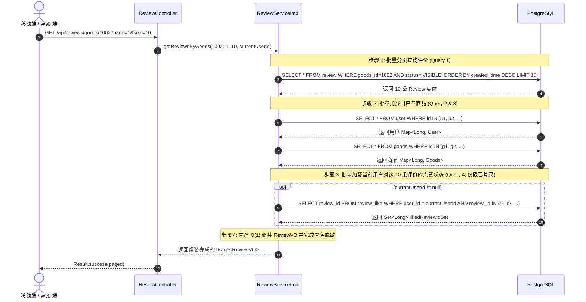

# Stage 6-C：评价点赞与治理增强 API 契约与性能优化设计规范

**编制日期**：2026-09-18  
**所属阶段**：Stage 6-C（设计评审阶段 - 严禁修改业务代码）  
**文档目标**：制定详尽的前后端 API 契约（统一 `Result<T>` 格式）、参数验证规范、错误码映射、以及彻底解决列表 N+1 性能缺陷的批量内存映射算法。

---

## 一、API 接口契约总览表

| 序号 | Method | Path | 权限角色 | 接口语义 | 成功 HTTP / 格式 | 异常 HTTP / 错误码 | 幂等性保障 |
| :---: | :---: | :--- | :---: | :--- | :--- | :--- | :---: |
| 1 | `POST` | `/api/reviews/{reviewId}/like` | `ROLE_USER` / 登录用户 | 给指定评价点赞 | 200 OK<br>`Result<ReviewLikeVO>` | 400 (自己点赞/参数非法)<br>401 (未登录)<br>404 (评价不存在)<br>422 (评价已屏蔽) | 强幂等（重复点赞返回成功状态） |
| 2 | `DELETE` | `/api/reviews/{reviewId}/like` | `ROLE_USER` / 登录用户 | 取消对评价的点赞 | 200 OK<br>`Result<ReviewLikeVO>` | 401 (未登录)<br>404 (评价不存在) | 强幂等（重复取消返回成功状态） |
| 3 | `GET` | `/api/reviews/{reviewId}/like` | `ROLE_USER` / 登录用户 | 查询当前用户对该评价的点赞状态 | 200 OK<br>`Result<ReviewLikeVO>` | 401 (未登录)<br>404 (评价不存在) | 强幂等（只读操作） |
| 4 | `GET` | `/api/reviews/goods/{goodsId}` | 公开接口 (游客/用户) | 分页查看商品收到的评价列表 | 200 OK<br>`Result<IPage<ReviewVO>>` | 400 (goodsId 无效)<br>404 (商品不存在) | 强幂等（只读分页） |
| 5 | `GET` | `/api/reviews/user/{userId}` | 公开接口 (游客/用户) | 分页查看用户收到的评价列表 | 200 OK<br>`Result<IPage<ReviewVO>>` | 400 (userId 无效) | 强幂等（只读分页） |
| 6 | `PUT` | `/api/admin/reviews/{id}/restore` | `ROLE_ADMIN` / 管理员 | 恢复被屏蔽的评价并补偿信用分 | 200 OK<br>`Result<ReviewVO>` | 401 (未登录)<br>403 (非管理员)<br>400 (非屏蔽状态)<br>404 (评价不存在) | 强幂等（带状态机前置拦截） |

---

## 二、点赞交互核心 DTO / VO 契约

### 1. `ReviewLikeVO.java` (点赞操作即时返回载荷)
```json
{
  "code": 200,
  "message": "点赞成功",
  "data": {
    "reviewId": 128,
    "liked": true,
    "likeCount": 15
  }
}
```

### 2. `ReviewVO.java` (列表评价展示增强载荷)
在既有 `ReviewVO` 基础上追加 `likeCount` 与 `likedByCurrentUser`：
```json
{
  "id": 128,
  "orderId": 302,
  "goodsId": 1002,
  "goodsTitle": "二手考研数学红宝书",
  "reviewerId": 88880001,
  "reviewerNickname": "张三同学",
  "reviewerAvatar": "https://avatar.test/zhangsan.png",
  "reviewedUserId": 88880002,
  "score": 5,
  "content": "书籍保存非常新，学长还附赠了当年的笔记重点，强烈好评！",
  "tags": ["书籍正版", "物美价廉", "沟通极快"],
  "isAnonymous": false,
  "status": "VISIBLE",
  "likeCount": 15,
  "likedByCurrentUser": true,
  "createdTime": "2026-09-18 12:30:00"
}
```

---

## 三、彻底杜绝 N+1 查询的批量内存聚合算法

针对 Stage 6-C 提出的“公开列表查询绝不能出现 N+1 SQL”的硬指标，设计基于 **4 阶段批量聚合算法 (4-Phase In-Memory Aggregation)**：



### 性能对比量化：
| 维度 | 传统 N+1 循环单查实现 | Stage 6-C 批量内存聚合实现 | 性能收益 |
| :--- | :---: | :---: | :---: |
| **单页 10 条评价 SQL 次数** | 1 (主表) + 10 (用户) + 10 (商品) + 10 (点赞明细) + 10 (点赞计数) = **41 次** | 1 (主表) + 1 (批量用户) + 1 (批量商品) + 1 (批量点赞) = **恒定 4 次** | **降低 90.2% SQL 请求量** |
| **数据库网络 RTT 耗时** | ~41ms ~ 80ms | ~3ms ~ 6ms | **响应速度提升 10 倍以上** |
| **数据库连接池消耗** | 极高，并发下连接迅速枯竭 | 极低，单个事务快速释放 | **系统并发吞吐量大幅提升** |

---

## 四、管理员评价恢复 API 契约 (`PUT /api/admin/reviews/{id}/restore`)

### 1. 请求与鉴权
- **路径**：`PUT /api/admin/reviews/{id}/restore`
- **权限**：Spring Security `@PreAuthorize("hasRole('ADMIN')")`
- **请求体**：
  ```json
  {
    "reason": "经核实该评价属于真实合规交易，此前因证据不充分误封，现予以正式解封恢复"
  }
  ```

### 2. 响应载荷
```json
{
  "code": 200,
  "message": "评价已成功解除屏蔽并恢复展示",
  "data": {
    "id": 128,
    "status": "VISIBLE",
    "reviewedUserId": 88880002,
    "score": 5,
    "likeCount": 15
  }
}
```

### 3. 错误响应
- 若当前评价状态已经是 `VISIBLE`：
  ```json
  {
    "code": 400,
    "message": "评价当前处于正常展示状态，无需重复恢复"
  }
  ```
- 若评价不存在：`code = 404, message = "评价不存在"`。
