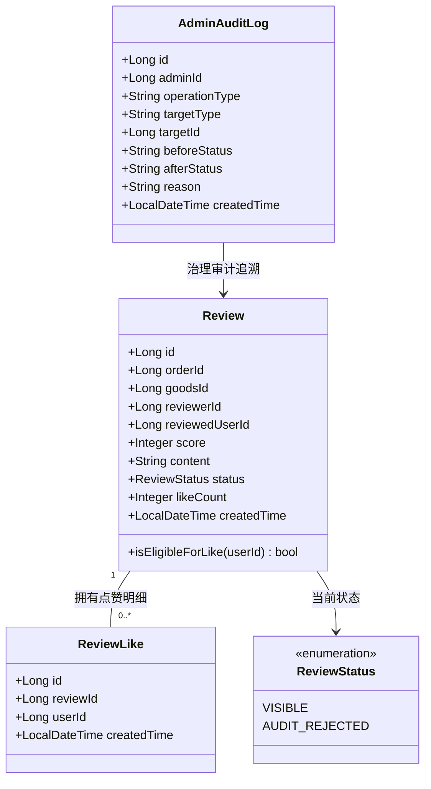

# Stage 6-C：评价点赞与治理增强领域模型设计规范

**编制日期**：2026-09-18  
**所属阶段**：Stage 6-C（设计评审阶段 - 严禁修改业务代码）  
**文档目标**：定义评价点赞的领域对象、行为边界、自点赞防御、点赞与屏蔽治理的联动规则，以及管理员评价恢复与信用二次补偿机制。

---

## 一、领域模型全景图 (Domain Architecture)



---

## 二、核心领域行为与规则设计

### 1. 点赞动作 (Like Review)
- **业务语义**：用户认为该条评价客观、详实、对其他校友选购或履约有参考价值（即“有用评价”投票）；
- **操作前提条件**：
  1. 用户必须已登录（未登录抛出 `401 Unauthorized`）；
  2. 被点赞的评价必须存在（不存在抛出 `404 Not Found`）；
  3. 评价状态必须为 `VISIBLE`（若为 `AUDIT_REJECTED` 违规屏蔽状态，抛出 `422 Unprocessable Entity ("该评价已被平台下架屏蔽，无法点赞")`）；
  4. **严禁自点赞**：评价作者本人不能给自己发表的评价点赞（`review.reviewerId.equals(currentUserId)` 抛出 `400 Bad Request ("不能为自己发表的评价点赞")`）；
- **幂等行为规范**：
  - 若用户此前未点赞：向 `review_like` 表插入记录，原子累加 `review.like_count + 1`，返回 `{ "liked": true, "likeCount": N }`；
  - 若用户此前已点赞（重复点赞）：被底层物理唯一索引 `uk_review_like_review_user` 强行拦截，事务回滚或直接返回当前成功态 `{ "liked": true, "likeCount": N }`，保障幂等安全。

---

### 2. 取消点赞动作 (Unlike Review)
- **业务语义**：用户撤销此前的“有用”投票；
- **操作前提条件**：
  1. 用户必须已登录（未登录返回 `401 Unauthorized`）；
  2. 评价必须存在（不存在返回 `404 Not Found`）；
- **幂等行为规范**：
  - 从 `review_like` 表中删除对应 `(review_id, user_id)` 记录；
  - 若实际删除了记录（影响行数 > 0）：执行 `UPDATE review SET like_count = GREATEST(0, like_count - 1) WHERE id = ?`；
  - 若记录原本不存在（重复取消）：不扣减计数，直接返回 `{ "liked": false, "likeCount": N }`。

---

### 3. API 语义选型深度权衡：Explicit RESTful vs Toggle

在系统架构设计中，针对移动端与 Web 端的点赞交互，对比两种主流方案：

| 对比维度 | 方案 A：显式 RESTful 端点 (推荐) | 方案 B：单个 Toggle 切换端点 |
| :--- | :--- | :--- |
| **API 设计** | `POST /api/reviews/{id}/like`<br>`DELETE /api/reviews/{id}/like` | `POST /api/reviews/{id}/like/toggle` |
| **幂等性 (Idempotency)** | **极高**。`POST` 永远代表期望置为“已赞”，`DELETE` 永远代表期望置为“未赞”。无论网络抖动重试多少次，状态始终确定。 | **极低**。若移动端弱网超时重试，偶数次重试将导致状态翻转（点赞变成取消，取消又变成点赞）。 |
| **并发竞态** | 无状态抖动。客户端明确声明其业务意图。 | 并发快速连击会导致服务端状态反复跳变。 |
| **Flutter 客户端契约** | Flutter Controller 只需调用 `like()` 或 `unlike()`，与 UI 状态严格对应。 | 前端必须非常小心防连击防重放。 |
| **架构决策** | **采纳方案 A 作为主规范**：遵循标准 HTTP 资源操作语义，保障网络重试安全性。 | 拒绝方案 B 作为唯一端点。可在 Controller 层额外提供 toggle 适配器，但核心业务层必须走显式幂等逻辑。 |

---

## 三、评价治理屏蔽 (`AUDIT_REJECTED`) 与点赞的关系设计

这是本阶段最关键的数据一致性与合规边界：

### 1. 屏蔽后的评价可见性与点赞透出
- **公开列表隔离**：`getReviewsByUser` 和 `getReviewsByGoods` 仅筛选 `status = 'VISIBLE'`。因此普通用户在任何公开商品或用户主页中**均无法看到被屏蔽的评价及其点赞数**；
- **订单参与方视角 (`getReviewByOrder`)**：
  - 买卖双方在订单详情页查看自身订单历史时，若评价被管理员屏蔽，应展示 `status: AUDIT_REJECTED`，并在 UI 提示“该评价因违规已被平台屏蔽，前台不可见”；
  - 此时点赞按钮置灰禁用，不再向作者或交易对手透出互动。

### 2. 屏蔽后的点赞限制
- **阻断新增点赞**：若攻击者绕过前端直接调用 `POST /api/reviews/{id}/like`：
  - Service 校验 `review.getStatus() == ReviewStatus.AUDIT_REJECTED`；
  - 严格阻断并抛出 `BusinessException(422, "该评价已被平台下架屏蔽，无法进行互动操作")`；
- **历史点赞数据处置：坚决保留，禁止物理删除**：
  - **合规审计要求**：保留 `review_like` 明细记录对于平台治理至关重要。例如，若某评价是因“组织水军刷赞冲热评”而被举报，保留历史点赞人 ID 才能为平台封禁作弊水军提供确凿证据；
  - **恢复容灾要求**：若管理员因证据不足误封了评价，后续纠偏恢复时，原有校友点赞数据无需重新初始化。

---

## 四、管理员评价治理增强：评价恢复 (Review Restoration) 设计

Stage 6-B 实现了举报工单采纳时的屏蔽与信用追缴（`AUDIT_REJECTED` + `Credit Reversal`）。本阶段评审引入**管理员纠偏恢复机制**：

### 1. 业务场景
管理员误封正常评价，或者用户申诉成功后，管理员在后台执行“解除屏蔽，恢复展示”。

### 2. 状态流转与信用反向补偿 (Credit Restoration)
```text
AUDIT_REJECTED ──[ 管理员操作: RESTORE ]──> VISIBLE
```
信用补偿铁律：
- 若该评价最初因高分获得了加分，在屏蔽时被扣减了对应分值；
- 则在恢复为 `VISIBLE` 时，**必须且仅能精确补回对应的信用分**：
  - 原 5 星好评：补回 +3 分 (`CreditChangeType.ADMIN_ADJUST`)
  - 原 4 星好评：补回 +1 分 (`CreditChangeType.ADMIN_ADJUST`)
  - 原 2 星差评：重新扣减 -2 分 (`CreditChangeType.ADMIN_ADJUST`)
  - 原 1 星差评：重新扣减 -5 分 (`CreditChangeType.ADMIN_ADJUST`)
  - 原 3 星评价：0 分，不调整。

### 3. 强幂等与审计要求
- 必须校验当前状态严格为 `AUDIT_REJECTED`，若已是 `VISIBLE` 则抛出 `400 Bad Request ("评价当前处于正常展示状态，无需恢复")`；
- 必须写入不可篡改的 `admin_audit_log`（`operationType = "RESTORE_REVIEW"`, `beforeStatus = "AUDIT_REJECTED"`, `afterStatus = "VISIBLE"`）；
- 必须由 `CreditService` 统一执行积分调整，记录 `user_credit_log`。
