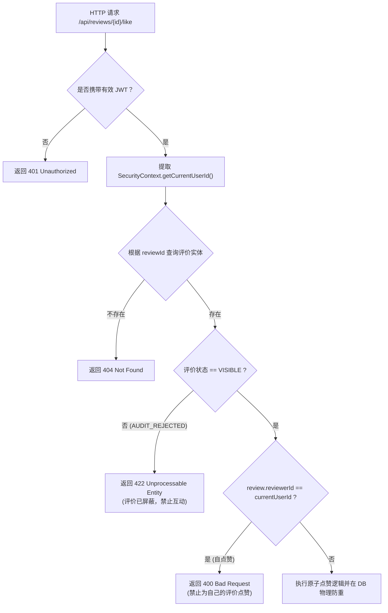

# Stage 6-C：评价点赞与治理安全架构设计规范

**编制日期**：2026-09-18  
**所属阶段**：Stage 6-C（设计评审阶段 - 严禁修改业务代码）  
**文档目标**：针对点赞与评价治理中的垂直越权、水平越权 (IDOR)、自点赞作弊、屏蔽信息泄露以及敏感参数攻击设计全面的多层防御机制。

---

## 一、权限矩阵与边界拦截模型



---

## 二、专项安全威胁与防御对策

### 1. 水平越权 (IDOR - Insecure Direct Object Reference) 防御
- **攻击场景一：冒充他人点赞**  
  攻击者在请求体中传入 `"userId": 9999`，企图冒充大 V 或其他校友给指定评价刷赞。  
  - **防御铁律**：API 契约中**严禁在请求体或 Query 参数中接收 `userId`**。点赞人身份一律由服务端的 `SecurityUtils.getCurrentUsername()` 结合数据库查询解析出的 `user.getId()` 强制填充，客户端传入的任何用户字段直接忽略。
- **攻击场景二：越权取消他人的点赞**  
  攻击者企图调用 `DELETE /api/reviews/{id}/like` 取消竞争对手或正常用户的点赞记录。  
  - **防御铁律**：后端执行的 SQL 严格限定 `WHERE review_id = ? AND user_id = ?`，其中 `user_id` 为当前登录者 ID。即使知道其他人的 `review_like.id`，也无法影响他人的点赞记录。

---

### 2. 自点赞防刷机制 (Self-Liking Prevention)
- **业务安全考量**：  
  在二手交易场景中，评价信用具有强烈的第三方背书属性。若允许卖家或买家给自己的评价点赞，将诱发虚荣刷赞行为，破坏平台评价公信力。
- **技术防线**：  
  在 `ReviewLikeService` 中，在执行任何写库前强置检查：
  ```java
  if (Objects.equals(review.getReviewerId(), currentUserId)) {
      throw new BusinessException(400, "不能为自己发表的评价点赞");
  }
  ```

---

### 3. 被屏蔽评价 (`AUDIT_REJECTED`) 的信息隔离与互动阻断
- **防御原则**：被平台判定为违规并执行治理屏蔽的评价，必须处于“冷冻隔离”状态。
- **信息泄露防护**：
  - 公开列表（商品详情页、个人主页）直接增加 `status = 'VISIBLE'` 过滤，普通用户无论是分页浏览还是通过 ID 单条查询，均无法检索到违规内容；
- **非法互动阻断**：
  - 若黑产或恶意脚本尝试通过遍历 `reviewId` 对已被屏蔽的评价调用 `POST /like`：
  - 系统识别到 `review.getStatus() == ReviewStatus.AUDIT_REJECTED` 时，立即终止并返回 `422 Unprocessable Entity`（或 `404 Not Found`）。

---

### 4. 管理员治理接口的垂直越权防护
- **威胁场景**：普通学生用户通过抓包探测，尝试调用恢复接口 `PUT /api/admin/reviews/{id}/restore` 自行解封被屏蔽的恶意评价。
- **防御对策**：
  1. **URL 路由层**：`SecurityConfig` 中已全局锁定 `.requestMatchers("/admin/**", "/api/admin/**").hasRole("ADMIN")`；
  2. **方法注解层**：在管理员控制类/方法上显式标记 `@PreAuthorize("hasRole('ADMIN')")`；
  3. **身份核验**：若 JWT 载荷中的 `role` 不等于 `"ADMIN"`，直接由 Spring Security 的 `AccessDeniedHandler` 拦截并返回 `403 Forbidden`。
